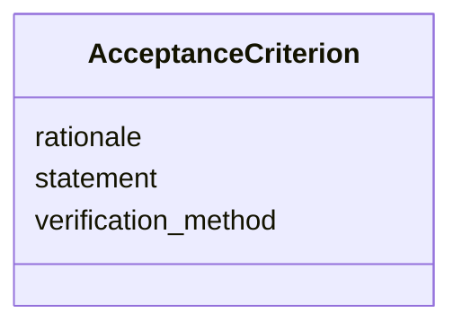

---
search:
  boost: 10.0
---

# Class: AcceptanceCriterion 


_A single, testable condition for accepting a deliverable. Bundles the criterion statement with an optional verification method and rationale, so review and audit can resolve each criterion independently._


<div data-search-exclude markdown="1">


URI: [core:AcceptanceCriterion](https://w3id.org/collabri/core/AcceptanceCriterion)





<!-- no inheritance hierarchy -->

## Slots

| Name | Cardinality and Range | Description | Inheritance |
| ---  | --- | --- | --- |
| [statement](statement.md) | 1 <br/> [String](String.md) | The acceptance condition expressed as a single, checkable statement | direct |
| [verification_method](verification_method.md) | 0..1 <br/> [String](String.md) | How the criterion will be checked (e | direct |
| [rationale](rationale.md) | 0..1 <br/> [String](String.md) | Why this criterion was chosen | direct |


## Usages

| used by | used in | type | used |
| ---  | --- | --- | --- |
| [Deliverable](Deliverable.md) | [acceptance_criteria](acceptance_criteria.md) | range | [AcceptanceCriterion](AcceptanceCriterion.md) |
| [Activity](Activity.md) | [acceptance_criteria](acceptance_criteria.md) | range | [AcceptanceCriterion](AcceptanceCriterion.md) |
| [Data](Data.md) | [acceptance_criteria](acceptance_criteria.md) | range | [AcceptanceCriterion](AcceptanceCriterion.md) |
| [Method](Method.md) | [acceptance_criteria](acceptance_criteria.md) | range | [AcceptanceCriterion](AcceptanceCriterion.md) |
| [NarrativeDocument](NarrativeDocument.md) | [acceptance_criteria](acceptance_criteria.md) | range | [AcceptanceCriterion](AcceptanceCriterion.md) |
| [Software](Software.md) | [acceptance_criteria](acceptance_criteria.md) | range | [AcceptanceCriterion](AcceptanceCriterion.md) |
| [Standard](Standard.md) | [acceptance_criteria](acceptance_criteria.md) | range | [AcceptanceCriterion](AcceptanceCriterion.md) |


## Identifier and Mapping Information


### Schema Source


* from schema: https://w3id.org/collabri/core


## Mappings

| Mapping Type | Mapped Value |
| ---  | ---  |
| self | core:AcceptanceCriterion |
| native | core:AcceptanceCriterion |
| close | cco:ont00000958, fibo_ctr:ContractualCommitment |


## LinkML Source

<!-- TODO: investigate https://stackoverflow.com/questions/37606292/how-to-create-tabbed-code-blocks-in-mkdocs-or-sphinx -->

### Direct

<details>
```yaml
name: AcceptanceCriterion
description: A single, testable condition for accepting a deliverable. Bundles the
  criterion statement with an optional verification method and rationale, so review
  and audit can resolve each criterion independently.
from_schema: https://w3id.org/collabri/core
close_mappings:
- cco:ont00000958
- fibo_ctr:ContractualCommitment
attributes:
  statement:
    name: statement
    description: The acceptance condition expressed as a single, checkable statement.
    in_subset:
    - sow_spec
    - execution_tracking
    from_schema: https://w3id.org/collabri/core
    slot_uri: dcterms:description
    domain_of:
    - Objective
    - AcceptanceCriterion
    required: true
  verification_method:
    name: verification_method
    description: How the criterion will be checked (e.g. "test suite green", "editorial
      review", "demo accepted by sponsor").
    in_subset:
    - sow_spec
    - execution_tracking
    from_schema: https://w3id.org/collabri/core
    rank: 1000
    domain_of:
    - AcceptanceCriterion
  rationale:
    name: rationale
    description: Why this criterion was chosen.
    in_subset:
    - sow_spec
    - execution_tracking
    from_schema: https://w3id.org/collabri/core
    close_mappings:
    - skos:scopeNote
    rank: 1000
    domain_of:
    - AcceptanceCriterion
    - Metric

```
</details>

### Induced

<details>
```yaml
name: AcceptanceCriterion
description: A single, testable condition for accepting a deliverable. Bundles the
  criterion statement with an optional verification method and rationale, so review
  and audit can resolve each criterion independently.
from_schema: https://w3id.org/collabri/core
close_mappings:
- cco:ont00000958
- fibo_ctr:ContractualCommitment
attributes:
  statement:
    name: statement
    description: The acceptance condition expressed as a single, checkable statement.
    in_subset:
    - sow_spec
    - execution_tracking
    from_schema: https://w3id.org/collabri/core
    slot_uri: dcterms:description
    owner: AcceptanceCriterion
    domain_of:
    - Objective
    - AcceptanceCriterion
    range: string
    required: true
  verification_method:
    name: verification_method
    description: How the criterion will be checked (e.g. "test suite green", "editorial
      review", "demo accepted by sponsor").
    in_subset:
    - sow_spec
    - execution_tracking
    from_schema: https://w3id.org/collabri/core
    rank: 1000
    owner: AcceptanceCriterion
    domain_of:
    - AcceptanceCriterion
    range: string
  rationale:
    name: rationale
    description: Why this criterion was chosen.
    in_subset:
    - sow_spec
    - execution_tracking
    from_schema: https://w3id.org/collabri/core
    close_mappings:
    - skos:scopeNote
    rank: 1000
    owner: AcceptanceCriterion
    domain_of:
    - AcceptanceCriterion
    - Metric
    range: string

```
</details></div>