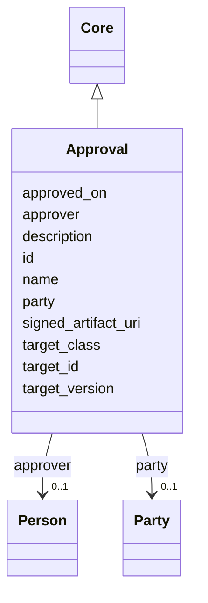

---
search:
  boost: 10.0
---

# Class: Approval 


_Signoff on a specific version of a SOW element._


<div data-search-exclude markdown="1">


URI: [core:Approval](https://w3id.org/collabri/core/Approval)





## Inheritance
* [Core](Core.md)
    * **Approval**


## Slots

| Name | Cardinality and Range | Description | Inheritance |
| ---  | --- | --- | --- |
| [target_class](target_class.md) | 0..1 <br/> [String](String.md) | Class of the target (Task, Subtask, Milestone, Deliverable, etc | direct |
| [target_id](target_id.md) | 0..1 <br/> [String](String.md) | ID of the element being approved | direct |
| [target_version](target_version.md) | 0..1 <br/> [String](String.md) | pav:version of the target at time of approval | direct |
| [approver](approver.md) | 0..1 <br/> [Person](Person.md) | The person signing off | direct |
| [party](party.md) | 0..1 <br/> [Party](Party.md) | Party the approver is signing on behalf of | direct |
| [approved_on](approved_on.md) | 0..1 <br/> [Date](Date.md) | Date the approval was recorded | direct |
| [signed_artifact_uri](signed_artifact_uri.md) | 0..1 <br/> [String](String.md) | Pointer to the executed envelope (DocuSign, etc | direct |
| [id](id.md) | 1 <br/> [String](String.md) | Stable identifier; together with version forms the element IRI | [Core](Core.md) |
| [name](name.md) | 1 <br/> [String](String.md) | Human-readable name | [Core](Core.md) |
| [description](description.md) | 0..1 <br/> [String](String.md) | Narrative description | [Core](Core.md) |


## Usages

| used by | used in | type | used |
| ---  | --- | --- | --- |
| [TaskTeam](TaskTeam.md) | [approvals](approvals.md) | range | [Approval](Approval.md) |


## Identifier and Mapping Information


### Schema Source


* from schema: https://w3id.org/collabri/core


## Mappings

| Mapping Type | Mapped Value |
| ---  | ---  |
| self | core:Approval |
| native | core:Approval |


## LinkML Source

<!-- TODO: investigate https://stackoverflow.com/questions/37606292/how-to-create-tabbed-code-blocks-in-mkdocs-or-sphinx -->

### Direct

<details>
```yaml
name: Approval
description: Signoff on a specific version of a SOW element.
from_schema: https://w3id.org/collabri/core
is_a: Core
attributes:
  target_class:
    name: target_class
    description: Class of the target (Task, Subtask, Milestone, Deliverable, etc.).
    in_subset:
    - execution_tracking
    from_schema: https://w3id.org/collabri/core
    domain_of:
    - Change
    - Approval
  target_id:
    name: target_id
    description: ID of the element being approved.
    in_subset:
    - execution_tracking
    from_schema: https://w3id.org/collabri/core
    domain_of:
    - Change
    - Approval
  target_version:
    name: target_version
    description: pav:version of the target at time of approval.
    in_subset:
    - execution_tracking
    from_schema: https://w3id.org/collabri/core
    domain_of:
    - Change
    - Approval
  approver:
    name: approver
    description: The person signing off.
    in_subset:
    - execution_tracking
    from_schema: https://w3id.org/collabri/core
    rank: 1000
    domain_of:
    - Approval
    range: Person
  party:
    name: party
    description: Party the approver is signing on behalf of.
    in_subset:
    - execution_tracking
    from_schema: https://w3id.org/collabri/core
    rank: 1000
    domain_of:
    - Approval
    range: Party
  approved_on:
    name: approved_on
    description: Date the approval was recorded.
    in_subset:
    - execution_tracking
    from_schema: https://w3id.org/collabri/core
    rank: 1000
    domain_of:
    - Approval
    range: date
  signed_artifact_uri:
    name: signed_artifact_uri
    description: Pointer to the executed envelope (DocuSign, etc.).
    in_subset:
    - execution_tracking
    from_schema: https://w3id.org/collabri/core
    domain_of:
    - ChangeProposal
    - Approval

```
</details>

### Induced

<details>
```yaml
name: Approval
description: Signoff on a specific version of a SOW element.
from_schema: https://w3id.org/collabri/core
is_a: Core
attributes:
  target_class:
    name: target_class
    description: Class of the target (Task, Subtask, Milestone, Deliverable, etc.).
    in_subset:
    - execution_tracking
    from_schema: https://w3id.org/collabri/core
    owner: Approval
    domain_of:
    - Change
    - Approval
    range: string
  target_id:
    name: target_id
    description: ID of the element being approved.
    in_subset:
    - execution_tracking
    from_schema: https://w3id.org/collabri/core
    owner: Approval
    domain_of:
    - Change
    - Approval
    range: string
  target_version:
    name: target_version
    description: pav:version of the target at time of approval.
    in_subset:
    - execution_tracking
    from_schema: https://w3id.org/collabri/core
    owner: Approval
    domain_of:
    - Change
    - Approval
    range: string
  approver:
    name: approver
    description: The person signing off.
    in_subset:
    - execution_tracking
    from_schema: https://w3id.org/collabri/core
    rank: 1000
    owner: Approval
    domain_of:
    - Approval
    range: Person
  party:
    name: party
    description: Party the approver is signing on behalf of.
    in_subset:
    - execution_tracking
    from_schema: https://w3id.org/collabri/core
    rank: 1000
    owner: Approval
    domain_of:
    - Approval
    range: Party
  approved_on:
    name: approved_on
    description: Date the approval was recorded.
    in_subset:
    - execution_tracking
    from_schema: https://w3id.org/collabri/core
    rank: 1000
    owner: Approval
    domain_of:
    - Approval
    range: date
  signed_artifact_uri:
    name: signed_artifact_uri
    description: Pointer to the executed envelope (DocuSign, etc.).
    in_subset:
    - execution_tracking
    from_schema: https://w3id.org/collabri/core
    owner: Approval
    domain_of:
    - ChangeProposal
    - Approval
    range: string
  id:
    name: id
    description: Stable identifier; together with version forms the element IRI.
    in_subset:
    - sow_spec
    - execution_tracking
    from_schema: https://w3id.org/collabri/core
    exact_mappings:
    - schema:identifier
    rank: 1000
    slot_uri: dcterms:identifier
    identifier: true
    owner: Approval
    domain_of:
    - Core
    - Change
    - Organization
    - Person
    range: string
    required: true
  name:
    name: name
    description: Human-readable name.
    in_subset:
    - sow_spec
    - execution_tracking
    from_schema: https://w3id.org/collabri/core
    exact_mappings:
    - dcterms:title
    - foaf:name
    rank: 1000
    slot_uri: schema:name
    owner: Approval
    domain_of:
    - Core
    - Metric
    - Organization
    - Person
    range: string
    required: true
  description:
    name: description
    description: Narrative description.
    in_subset:
    - sow_spec
    - execution_tracking
    from_schema: https://w3id.org/collabri/core
    exact_mappings:
    - schema:description
    rank: 1000
    slot_uri: dcterms:description
    owner: Approval
    domain_of:
    - Core
    range: string

```
</details></div>