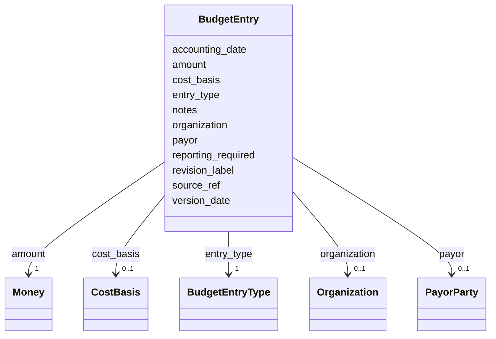

---
search:
  boost: 10.0
---

# Class: BudgetEntry 


_One datestamped budget snapshot for a spending unit (TaskTeam, Subtask, or Payment). Every entry captures: which view it represents (proposed / awarded / working / actual / encumbrance), the amount, the date the snapshot was recorded (version_date), the accounting period it pertains to (accounting_date, on actuals), the cost basis (fixed_price vs cost_reimbursable etc.), the payor, and an optional organization breakdown._

_Versioning is by accumulation: rather than overwrite a single "working amount," each negotiation round / award modification / monthly accounting close adds a new BudgetEntry. The "current" view of any type is the latest version_date entry of that type._

_version_date vs accounting_date matter most for actuals because reconciliation takes time. Books for the period close on the accounting_date (e.g. 2026-12-31 for Q4), but the figure isn't reported until weeks later (the version_date — e.g. 2027-01-20) because the close cycle is non-trivial. The same shape carries restatements without ambiguity: a corrected Q4 figure reported in March 2027 has accounting_date 2026-12-31 and version_date 2027-03-15. Both facts are preserved._

_Cost basis lives at the entry level (not at Subtask or Payment) so the common pattern where a prime is cost-reimbursable but individual subs are fixed-price can be expressed natively: the prime's working-budget entry carries cost_basis=cost_reimbursable and each sub's working-budget entry carries cost_basis=fixed_price._


<div data-search-exclude markdown="1">


URI: [core:BudgetEntry](https://w3id.org/collabri/core/BudgetEntry)





<!-- no inheritance hierarchy -->

## Slots

| Name | Cardinality and Range | Description | Inheritance |
| ---  | --- | --- | --- |
| [entry_type](entry_type.md) | 1 <br/> [BudgetEntryType](BudgetEntryType.md) | Which budget view this entry represents | direct |
| [amount](amount.md) | 1 <br/> [Money](Money.md) | The amount, with currency | direct |
| [version_date](version_date.md) | 1 <br/> [Date](Date.md) | The date this entry was recorded / reported out | direct |
| [accounting_date](accounting_date.md) | 0..1 <br/> [Date](Date.md) | The accounting period this entry pertains to — i | direct |
| [cost_basis](cost_basis.md) | 0..1 <br/> [CostBasis](CostBasis.md) | Contractual cost-determination mechanism for this entry (fixed_price, cost_re... | direct |
| [payor](payor.md) | 0..1 <br/> [PayorParty](PayorParty.md) | Which party owes or paid this amount (sponsor or prime) | direct |
| [organization](organization.md) | 0..1 <br/> [Organization](Organization.md) | Specific organization this entry breaks out, on multi-org payable subtasks | direct |
| [revision_label](revision_label.md) | 0..1 <br/> [String](String.md) | Optional human label for this snapshot (e | direct |
| [reporting_required](reporting_required.md) | 0..1 <br/> [Boolean](Boolean.md) | True iff this entry exists to satisfy a contractually-required reporting obli... | direct |
| [source_ref](source_ref.md) | 0..1 <br/> [String](String.md) | Pointer to the document or accounting record this entry derives from — a Chan... | direct |
| [notes](notes.md) | 0..1 <br/> [String](String.md) | Free-text annotation | direct |


## Usages

| used by | used in | type | used |
| ---  | --- | --- | --- |
| [TaskTeam](TaskTeam.md) | [budget_entries](budget_entries.md) | range | [BudgetEntry](BudgetEntry.md) |
| [Subtask](Subtask.md) | [budget_entries](budget_entries.md) | range | [BudgetEntry](BudgetEntry.md) |
| [Payment](Payment.md) | [budget_entries](budget_entries.md) | range | [BudgetEntry](BudgetEntry.md) |


## Rules


### actuals_require_accounting_date

| Rule Applied | Preconditions | Postconditions | Elseconditions |
|--------------|---------------|----------------|----------------|
| slot_conditions |```{'entry_type': {'equals_string': 'actual'}}``` |```{'accounting_date': {'required': True}}``` | |


## Identifier and Mapping Information


### Schema Source


* from schema: https://w3id.org/collabri/core


## Mappings

| Mapping Type | Mapped Value |
| ---  | ---  |
| self | core:BudgetEntry |
| native | core:BudgetEntry |
| close | gist:Commitment, fibo_ctr:ContractualCommitment, schema:price |


## LinkML Source

<!-- TODO: investigate https://stackoverflow.com/questions/37606292/how-to-create-tabbed-code-blocks-in-mkdocs-or-sphinx -->

### Direct

<details>
```yaml
name: BudgetEntry
description: 'One datestamped budget snapshot for a spending unit (TaskTeam, Subtask,
  or Payment). Every entry captures: which view it represents (proposed / awarded
  / working / actual / encumbrance), the amount, the date the snapshot was recorded
  (version_date), the accounting period it pertains to (accounting_date, on actuals),
  the cost basis (fixed_price vs cost_reimbursable etc.), the payor, and an optional
  organization breakdown.

  Versioning is by accumulation: rather than overwrite a single "working amount,"
  each negotiation round / award modification / monthly accounting close adds a new
  BudgetEntry. The "current" view of any type is the latest version_date entry of
  that type.

  version_date vs accounting_date matter most for actuals because reconciliation takes
  time. Books for the period close on the accounting_date (e.g. 2026-12-31 for Q4),
  but the figure isn''t reported until weeks later (the version_date — e.g. 2027-01-20)
  because the close cycle is non-trivial. The same shape carries restatements without
  ambiguity: a corrected Q4 figure reported in March 2027 has accounting_date 2026-12-31
  and version_date 2027-03-15. Both facts are preserved.

  Cost basis lives at the entry level (not at Subtask or Payment) so the common pattern
  where a prime is cost-reimbursable but individual subs are fixed-price can be expressed
  natively: the prime''s working-budget entry carries cost_basis=cost_reimbursable
  and each sub''s working-budget entry carries cost_basis=fixed_price.'
from_schema: https://w3id.org/collabri/core
close_mappings:
- gist:Commitment
- fibo_ctr:ContractualCommitment
- schema:price
attributes:
  entry_type:
    name: entry_type
    description: Which budget view this entry represents.
    in_subset:
    - sow_spec
    - execution_tracking
    from_schema: https://w3id.org/collabri/core
    rank: 1000
    domain_of:
    - BudgetEntry
    range: BudgetEntryType
    required: true
  amount:
    name: amount
    description: The amount, with currency.
    in_subset:
    - sow_spec
    - execution_tracking
    from_schema: https://w3id.org/collabri/core
    rank: 1000
    slot_uri: schema:price
    domain_of:
    - BudgetEntry
    range: Money
    required: true
    inlined: true
  version_date:
    name: version_date
    description: 'The date this entry was recorded / reported out. Required on every
      entry. Every entry is a dated point, so the negotiation, award, and execution
      history is captured by accumulating entries rather than overwriting values;
      multiple entries of the same entry_type with different version_dates represent
      the chronological history of that view.

      For actuals and encumbrance, version_date is when the snapshot was actually
      reported — which lags the period close, because reconciliation takes time. Example:
      books close 2026-12-31 (accounting_date) but the figure isn''t reported until
      2027-01-20 (version_date) because the close cycle takes three weeks. Same two-date
      structure also accommodates restatements: a corrected Q4 figure reported 2027-03-15
      has accounting_date 2026-12-31 and version_date 2027-03-15.'
    in_subset:
    - sow_spec
    - execution_tracking
    from_schema: https://w3id.org/collabri/core
    rank: 1000
    domain_of:
    - BudgetEntry
    range: date
    required: true
  accounting_date:
    name: accounting_date
    description: The accounting period this entry pertains to — i.e. when the books
      closed for the period the figures belong to. For actuals, this is the period
      close date (e.g. "2026-12-31" for Q4 2026 actuals); for encumbrance, the as-of
      date of the encumbrance state. Distinct from version_date because reconciliation
      lag, restatements, and audit corrections all cause the report-out date to differ
      from the close date — and both facts need to be preserved. Required on actual
      entries (enforced by rule); optional otherwise.
    in_subset:
    - sow_spec
    - execution_tracking
    from_schema: https://w3id.org/collabri/core
    rank: 1000
    domain_of:
    - BudgetEntry
    range: date
  cost_basis:
    name: cost_basis
    description: Contractual cost-determination mechanism for this entry (fixed_price,
      cost_reimbursable, time_and_materials, etc.). Lives per-entry so prime and subs
      can carry different bases within the same subtask.
    in_subset:
    - sow_spec
    - execution_tracking
    from_schema: https://w3id.org/collabri/core
    domain_of:
    - Payment
    - BudgetEntry
    range: CostBasis
  payor:
    name: payor
    description: Which party owes or paid this amount (sponsor or prime).
    in_subset:
    - sow_spec
    - execution_tracking
    from_schema: https://w3id.org/collabri/core
    domain_of:
    - Payment
    - BudgetEntry
    range: PayorParty
  organization:
    name: organization
    description: Specific organization this entry breaks out, on multi-org payable
      subtasks. Omit for totals not broken down by org.
    in_subset:
    - sow_spec
    - execution_tracking
    from_schema: https://w3id.org/collabri/core
    rank: 1000
    slot_uri: org:organization
    domain_of:
    - BudgetEntry
    range: Organization
  revision_label:
    name: revision_label
    description: Optional human label for this snapshot (e.g. "Initial proposal",
      "Post-Q&A revision", "Mod 0001 awarded", "FY26 Q2 close"). Useful when there
      are many same-typed entries.
    in_subset:
    - sow_spec
    - execution_tracking
    from_schema: https://w3id.org/collabri/core
    rank: 1000
    domain_of:
    - BudgetEntry
  reporting_required:
    name: reporting_required
    description: 'True iff this entry exists to satisfy a contractually-required reporting
      obligation (typically: actuals on cost-reimbursable awards, actuals on fixed-price
      awards where the sponsor still mandates cost reporting, encumbrance reporting
      on a defined cadence, etc.). Distinguishes contractually-mandated entries from
      optional internal tracking. The full obligation detail — cadence, template,
      recipient — lives in a corresponding ReportingObligation on TaskTeam.obligations.'
    in_subset:
    - sow_spec
    - execution_tracking
    from_schema: https://w3id.org/collabri/core
    rank: 1000
    domain_of:
    - BudgetEntry
    range: boolean
  source_ref:
    name: source_ref
    description: Pointer to the document or accounting record this entry derives from
      — a ChangeProposal IRI, an award-mod number, an AP ledger entry, etc. Becomes
      the audit trail for the snapshot.
    in_subset:
    - sow_spec
    - execution_tracking
    from_schema: https://w3id.org/collabri/core
    rank: 1000
    domain_of:
    - BudgetEntry
  notes:
    name: notes
    description: Free-text annotation.
    in_subset:
    - sow_spec
    - execution_tracking
    from_schema: https://w3id.org/collabri/core
    domain_of:
    - Objective
    - BudgetEntry
rules:
- preconditions:
    slot_conditions:
      entry_type:
        name: entry_type
        equals_string: actual
  postconditions:
    slot_conditions:
      accounting_date:
        name: accounting_date
        required: true
  description: An actual entry must carry an accounting_date so the period the actuals
    belong to is unambiguous (independent of when the snapshot was recorded).
  title: actuals_require_accounting_date

```
</details>

### Induced

<details>
```yaml
name: BudgetEntry
description: 'One datestamped budget snapshot for a spending unit (TaskTeam, Subtask,
  or Payment). Every entry captures: which view it represents (proposed / awarded
  / working / actual / encumbrance), the amount, the date the snapshot was recorded
  (version_date), the accounting period it pertains to (accounting_date, on actuals),
  the cost basis (fixed_price vs cost_reimbursable etc.), the payor, and an optional
  organization breakdown.

  Versioning is by accumulation: rather than overwrite a single "working amount,"
  each negotiation round / award modification / monthly accounting close adds a new
  BudgetEntry. The "current" view of any type is the latest version_date entry of
  that type.

  version_date vs accounting_date matter most for actuals because reconciliation takes
  time. Books for the period close on the accounting_date (e.g. 2026-12-31 for Q4),
  but the figure isn''t reported until weeks later (the version_date — e.g. 2027-01-20)
  because the close cycle is non-trivial. The same shape carries restatements without
  ambiguity: a corrected Q4 figure reported in March 2027 has accounting_date 2026-12-31
  and version_date 2027-03-15. Both facts are preserved.

  Cost basis lives at the entry level (not at Subtask or Payment) so the common pattern
  where a prime is cost-reimbursable but individual subs are fixed-price can be expressed
  natively: the prime''s working-budget entry carries cost_basis=cost_reimbursable
  and each sub''s working-budget entry carries cost_basis=fixed_price.'
from_schema: https://w3id.org/collabri/core
close_mappings:
- gist:Commitment
- fibo_ctr:ContractualCommitment
- schema:price
attributes:
  entry_type:
    name: entry_type
    description: Which budget view this entry represents.
    in_subset:
    - sow_spec
    - execution_tracking
    from_schema: https://w3id.org/collabri/core
    rank: 1000
    owner: BudgetEntry
    domain_of:
    - BudgetEntry
    range: BudgetEntryType
    required: true
  amount:
    name: amount
    description: The amount, with currency.
    in_subset:
    - sow_spec
    - execution_tracking
    from_schema: https://w3id.org/collabri/core
    rank: 1000
    slot_uri: schema:price
    owner: BudgetEntry
    domain_of:
    - BudgetEntry
    range: Money
    required: true
    inlined: true
  version_date:
    name: version_date
    description: 'The date this entry was recorded / reported out. Required on every
      entry. Every entry is a dated point, so the negotiation, award, and execution
      history is captured by accumulating entries rather than overwriting values;
      multiple entries of the same entry_type with different version_dates represent
      the chronological history of that view.

      For actuals and encumbrance, version_date is when the snapshot was actually
      reported — which lags the period close, because reconciliation takes time. Example:
      books close 2026-12-31 (accounting_date) but the figure isn''t reported until
      2027-01-20 (version_date) because the close cycle takes three weeks. Same two-date
      structure also accommodates restatements: a corrected Q4 figure reported 2027-03-15
      has accounting_date 2026-12-31 and version_date 2027-03-15.'
    in_subset:
    - sow_spec
    - execution_tracking
    from_schema: https://w3id.org/collabri/core
    rank: 1000
    owner: BudgetEntry
    domain_of:
    - BudgetEntry
    range: date
    required: true
  accounting_date:
    name: accounting_date
    description: The accounting period this entry pertains to — i.e. when the books
      closed for the period the figures belong to. For actuals, this is the period
      close date (e.g. "2026-12-31" for Q4 2026 actuals); for encumbrance, the as-of
      date of the encumbrance state. Distinct from version_date because reconciliation
      lag, restatements, and audit corrections all cause the report-out date to differ
      from the close date — and both facts need to be preserved. Required on actual
      entries (enforced by rule); optional otherwise.
    in_subset:
    - sow_spec
    - execution_tracking
    from_schema: https://w3id.org/collabri/core
    rank: 1000
    owner: BudgetEntry
    domain_of:
    - BudgetEntry
    range: date
  cost_basis:
    name: cost_basis
    description: Contractual cost-determination mechanism for this entry (fixed_price,
      cost_reimbursable, time_and_materials, etc.). Lives per-entry so prime and subs
      can carry different bases within the same subtask.
    in_subset:
    - sow_spec
    - execution_tracking
    from_schema: https://w3id.org/collabri/core
    owner: BudgetEntry
    domain_of:
    - Payment
    - BudgetEntry
    range: CostBasis
  payor:
    name: payor
    description: Which party owes or paid this amount (sponsor or prime).
    in_subset:
    - sow_spec
    - execution_tracking
    from_schema: https://w3id.org/collabri/core
    owner: BudgetEntry
    domain_of:
    - Payment
    - BudgetEntry
    range: PayorParty
  organization:
    name: organization
    description: Specific organization this entry breaks out, on multi-org payable
      subtasks. Omit for totals not broken down by org.
    in_subset:
    - sow_spec
    - execution_tracking
    from_schema: https://w3id.org/collabri/core
    rank: 1000
    slot_uri: org:organization
    owner: BudgetEntry
    domain_of:
    - BudgetEntry
    range: Organization
  revision_label:
    name: revision_label
    description: Optional human label for this snapshot (e.g. "Initial proposal",
      "Post-Q&A revision", "Mod 0001 awarded", "FY26 Q2 close"). Useful when there
      are many same-typed entries.
    in_subset:
    - sow_spec
    - execution_tracking
    from_schema: https://w3id.org/collabri/core
    rank: 1000
    owner: BudgetEntry
    domain_of:
    - BudgetEntry
    range: string
  reporting_required:
    name: reporting_required
    description: 'True iff this entry exists to satisfy a contractually-required reporting
      obligation (typically: actuals on cost-reimbursable awards, actuals on fixed-price
      awards where the sponsor still mandates cost reporting, encumbrance reporting
      on a defined cadence, etc.). Distinguishes contractually-mandated entries from
      optional internal tracking. The full obligation detail — cadence, template,
      recipient — lives in a corresponding ReportingObligation on TaskTeam.obligations.'
    in_subset:
    - sow_spec
    - execution_tracking
    from_schema: https://w3id.org/collabri/core
    rank: 1000
    owner: BudgetEntry
    domain_of:
    - BudgetEntry
    range: boolean
  source_ref:
    name: source_ref
    description: Pointer to the document or accounting record this entry derives from
      — a ChangeProposal IRI, an award-mod number, an AP ledger entry, etc. Becomes
      the audit trail for the snapshot.
    in_subset:
    - sow_spec
    - execution_tracking
    from_schema: https://w3id.org/collabri/core
    rank: 1000
    owner: BudgetEntry
    domain_of:
    - BudgetEntry
    range: string
  notes:
    name: notes
    description: Free-text annotation.
    in_subset:
    - sow_spec
    - execution_tracking
    from_schema: https://w3id.org/collabri/core
    owner: BudgetEntry
    domain_of:
    - Objective
    - BudgetEntry
    range: string
rules:
- preconditions:
    slot_conditions:
      entry_type:
        name: entry_type
        equals_string: actual
  postconditions:
    slot_conditions:
      accounting_date:
        name: accounting_date
        required: true
  description: An actual entry must carry an accounting_date so the period the actuals
    belong to is unambiguous (independent of when the snapshot was recorded).
  title: actuals_require_accounting_date

```
</details></div>