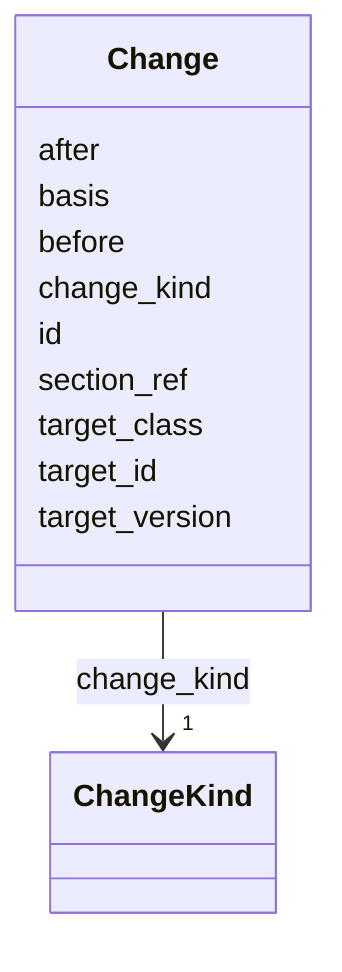

---
search:
  boost: 10.0
---

# Class: Change 


_A single element-level edit within a ChangeProposal._


<div data-search-exclude markdown="1">


URI: [core:Change](https://w3id.org/collabri/core/Change)





<!-- no inheritance hierarchy -->

## Slots

| Name | Cardinality and Range | Description | Inheritance |
| ---  | --- | --- | --- |
| [id](id.md) | 1 <br/> [String](String.md) |  | direct |
| [change_kind](change_kind.md) | 1 <br/> [ChangeKind](ChangeKind.md) | Kind of element-level edit | direct |
| [target_class](target_class.md) | 0..1 <br/> [String](String.md) | Class of the target (Task, Subtask, Milestone, Deliverable, etc | direct |
| [target_id](target_id.md) | 0..1 <br/> [String](String.md) | ID of the element being changed | direct |
| [target_version](target_version.md) | 0..1 <br/> [String](String.md) | pav:version of the target at time of the change | direct |
| [section_ref](section_ref.md) | 0..1 <br/> [String](String.md) | Section under change control, if scoped narrower than the full element | direct |
| [before](before.md) | 0..1 <br/> [String](String.md) | Snapshot of the element before the change (null for adds) | direct |
| [after](after.md) | 0..1 <br/> [String](String.md) | Snapshot of the element after the change (null for removes) | direct |
| [basis](basis.md) | 0..1 <br/> [String](String.md) | Free-text rationale for this specific change | direct |


## Usages

| used by | used in | type | used |
| ---  | --- | --- | --- |
| [ChangeProposal](ChangeProposal.md) | [changes](changes.md) | range | [Change](Change.md) |


## Identifier and Mapping Information


### Schema Source


* from schema: https://w3id.org/collabri/core


## Mappings

| Mapping Type | Mapped Value |
| ---  | ---  |
| self | core:Change |
| native | core:Change |


## LinkML Source

<!-- TODO: investigate https://stackoverflow.com/questions/37606292/how-to-create-tabbed-code-blocks-in-mkdocs-or-sphinx -->

### Direct

<details>
```yaml
name: Change
description: A single element-level edit within a ChangeProposal.
from_schema: https://w3id.org/collabri/core
attributes:
  id:
    name: id
    from_schema: https://w3id.org/collabri/core
    slot_uri: dcterms:identifier
    identifier: true
    domain_of:
    - Core
    - Change
    - Organization
    - Person
    required: true
  change_kind:
    name: change_kind
    description: Kind of element-level edit.
    from_schema: https://w3id.org/collabri/core
    rank: 1000
    domain_of:
    - Change
    range: ChangeKind
    required: true
  target_class:
    name: target_class
    description: Class of the target (Task, Subtask, Milestone, Deliverable, etc.).
    from_schema: https://w3id.org/collabri/core
    rank: 1000
    domain_of:
    - Change
    - Approval
  target_id:
    name: target_id
    description: ID of the element being changed.
    from_schema: https://w3id.org/collabri/core
    rank: 1000
    domain_of:
    - Change
    - Approval
  target_version:
    name: target_version
    description: pav:version of the target at time of the change.
    from_schema: https://w3id.org/collabri/core
    rank: 1000
    domain_of:
    - Change
    - Approval
  section_ref:
    name: section_ref
    description: Section under change control, if scoped narrower than the full element.
    from_schema: https://w3id.org/collabri/core
    rank: 1000
    domain_of:
    - Change
  before:
    name: before
    description: Snapshot of the element before the change (null for adds).
    from_schema: https://w3id.org/collabri/core
    rank: 1000
    domain_of:
    - Change
  after:
    name: after
    description: Snapshot of the element after the change (null for removes).
    from_schema: https://w3id.org/collabri/core
    rank: 1000
    domain_of:
    - Change
  basis:
    name: basis
    description: Free-text rationale for this specific change.
    from_schema: https://w3id.org/collabri/core
    rank: 1000
    domain_of:
    - Change

```
</details>

### Induced

<details>
```yaml
name: Change
description: A single element-level edit within a ChangeProposal.
from_schema: https://w3id.org/collabri/core
attributes:
  id:
    name: id
    from_schema: https://w3id.org/collabri/core
    slot_uri: dcterms:identifier
    identifier: true
    owner: Change
    domain_of:
    - Core
    - Change
    - Organization
    - Person
    range: string
    required: true
  change_kind:
    name: change_kind
    description: Kind of element-level edit.
    from_schema: https://w3id.org/collabri/core
    rank: 1000
    owner: Change
    domain_of:
    - Change
    range: ChangeKind
    required: true
  target_class:
    name: target_class
    description: Class of the target (Task, Subtask, Milestone, Deliverable, etc.).
    from_schema: https://w3id.org/collabri/core
    rank: 1000
    owner: Change
    domain_of:
    - Change
    - Approval
    range: string
  target_id:
    name: target_id
    description: ID of the element being changed.
    from_schema: https://w3id.org/collabri/core
    rank: 1000
    owner: Change
    domain_of:
    - Change
    - Approval
    range: string
  target_version:
    name: target_version
    description: pav:version of the target at time of the change.
    from_schema: https://w3id.org/collabri/core
    rank: 1000
    owner: Change
    domain_of:
    - Change
    - Approval
    range: string
  section_ref:
    name: section_ref
    description: Section under change control, if scoped narrower than the full element.
    from_schema: https://w3id.org/collabri/core
    rank: 1000
    owner: Change
    domain_of:
    - Change
    range: string
  before:
    name: before
    description: Snapshot of the element before the change (null for adds).
    from_schema: https://w3id.org/collabri/core
    rank: 1000
    owner: Change
    domain_of:
    - Change
    range: string
  after:
    name: after
    description: Snapshot of the element after the change (null for removes).
    from_schema: https://w3id.org/collabri/core
    rank: 1000
    owner: Change
    domain_of:
    - Change
    range: string
  basis:
    name: basis
    description: Free-text rationale for this specific change.
    from_schema: https://w3id.org/collabri/core
    rank: 1000
    owner: Change
    domain_of:
    - Change
    range: string

```
</details></div>