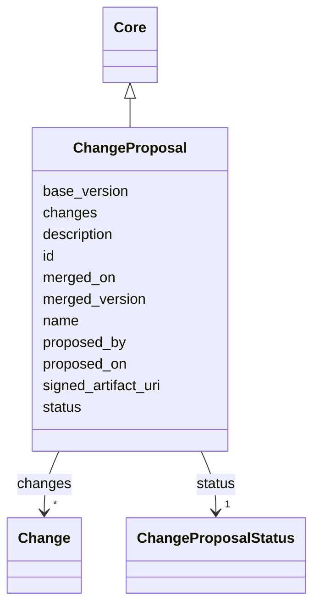

---
search:
  boost: 10.0
---

# Class: ChangeProposal 


_A bundled set of element-level Changes against a base SOW version, analogous to a GitHub pull request. Approvals against this proposal promote the merged_version to current._


<div data-search-exclude markdown="1">


URI: [core:ChangeProposal](https://w3id.org/collabri/core/ChangeProposal)





## Inheritance
* [Core](Core.md)
    * **ChangeProposal**


## Slots

| Name | Cardinality and Range | Description | Inheritance |
| ---  | --- | --- | --- |
| [base_version](base_version.md) | 0..1 <br/> [String](String.md) | Version of the SOW this proposal targets | direct |
| [proposed_by](proposed_by.md) | 0..1 <br/> [Uriorcurie](Uriorcurie.md) | Author of the proposal | direct |
| [proposed_on](proposed_on.md) | 0..1 <br/> [Date](Date.md) | Date the proposal was opened | direct |
| [status](status.md) | 1 <br/> [ChangeProposalStatus](ChangeProposalStatus.md) | Lifecycle of this proposal (open, merged, closed, etc | direct |
| [changes](changes.md) | * <br/> [Change](Change.md) | Element-level changes bundled in this proposal | direct |
| [merged_on](merged_on.md) | 0..1 <br/> [Date](Date.md) | Date the proposal was merged | direct |
| [merged_version](merged_version.md) | 0..1 <br/> [String](String.md) | Resulting SOW semver after merge | direct |
| [signed_artifact_uri](signed_artifact_uri.md) | 0..1 <br/> [String](String.md) | Pointer to the executed envelope (DocuSign, etc | direct |
| [id](id.md) | 1 <br/> [String](String.md) | Stable identifier; together with version forms the element IRI | [Core](Core.md) |
| [name](name.md) | 1 <br/> [String](String.md) | Human-readable name | [Core](Core.md) |
| [description](description.md) | 0..1 <br/> [String](String.md) | Narrative description | [Core](Core.md) |


## Usages

| used by | used in | type | used |
| ---  | --- | --- | --- |
| [TaskTeam](TaskTeam.md) | [change_proposals](change_proposals.md) | range | [ChangeProposal](ChangeProposal.md) |


## Identifier and Mapping Information


### Schema Source


* from schema: https://w3id.org/collabri/core


## Mappings

| Mapping Type | Mapped Value |
| ---  | ---  |
| self | core:ChangeProposal |
| native | core:ChangeProposal |


## LinkML Source

<!-- TODO: investigate https://stackoverflow.com/questions/37606292/how-to-create-tabbed-code-blocks-in-mkdocs-or-sphinx -->

### Direct

<details>
```yaml
name: ChangeProposal
description: A bundled set of element-level Changes against a base SOW version, analogous
  to a GitHub pull request. Approvals against this proposal promote the merged_version
  to current.
from_schema: https://w3id.org/collabri/core
is_a: Core
attributes:
  base_version:
    name: base_version
    description: Version of the SOW this proposal targets.
    in_subset:
    - execution_tracking
    from_schema: https://w3id.org/collabri/core
    rank: 1000
    domain_of:
    - ChangeProposal
  proposed_by:
    name: proposed_by
    description: Author of the proposal.
    in_subset:
    - execution_tracking
    from_schema: https://w3id.org/collabri/core
    rank: 1000
    domain_of:
    - ChangeProposal
    range: uriorcurie
  proposed_on:
    name: proposed_on
    description: Date the proposal was opened.
    in_subset:
    - execution_tracking
    from_schema: https://w3id.org/collabri/core
    rank: 1000
    domain_of:
    - ChangeProposal
    range: date
  status:
    name: status
    description: Lifecycle of this proposal (open, merged, closed, etc.).
    in_subset:
    - execution_tracking
    from_schema: https://w3id.org/collabri/core
    rank: 1000
    domain_of:
    - ChangeProposal
    range: ChangeProposalStatus
    required: true
  changes:
    name: changes
    description: Element-level changes bundled in this proposal.
    in_subset:
    - execution_tracking
    from_schema: https://w3id.org/collabri/core
    rank: 1000
    domain_of:
    - ChangeProposal
    range: Change
    multivalued: true
    inlined_as_list: true
  merged_on:
    name: merged_on
    description: Date the proposal was merged.
    in_subset:
    - execution_tracking
    from_schema: https://w3id.org/collabri/core
    rank: 1000
    domain_of:
    - ChangeProposal
    range: date
  merged_version:
    name: merged_version
    description: Resulting SOW semver after merge.
    in_subset:
    - execution_tracking
    from_schema: https://w3id.org/collabri/core
    rank: 1000
    domain_of:
    - ChangeProposal
  signed_artifact_uri:
    name: signed_artifact_uri
    description: Pointer to the executed envelope (DocuSign, etc.).
    in_subset:
    - execution_tracking
    from_schema: https://w3id.org/collabri/core
    rank: 1000
    domain_of:
    - ChangeProposal
    - Approval

```
</details>

### Induced

<details>
```yaml
name: ChangeProposal
description: A bundled set of element-level Changes against a base SOW version, analogous
  to a GitHub pull request. Approvals against this proposal promote the merged_version
  to current.
from_schema: https://w3id.org/collabri/core
is_a: Core
attributes:
  base_version:
    name: base_version
    description: Version of the SOW this proposal targets.
    in_subset:
    - execution_tracking
    from_schema: https://w3id.org/collabri/core
    rank: 1000
    owner: ChangeProposal
    domain_of:
    - ChangeProposal
    range: string
  proposed_by:
    name: proposed_by
    description: Author of the proposal.
    in_subset:
    - execution_tracking
    from_schema: https://w3id.org/collabri/core
    rank: 1000
    owner: ChangeProposal
    domain_of:
    - ChangeProposal
    range: uriorcurie
  proposed_on:
    name: proposed_on
    description: Date the proposal was opened.
    in_subset:
    - execution_tracking
    from_schema: https://w3id.org/collabri/core
    rank: 1000
    owner: ChangeProposal
    domain_of:
    - ChangeProposal
    range: date
  status:
    name: status
    description: Lifecycle of this proposal (open, merged, closed, etc.).
    in_subset:
    - execution_tracking
    from_schema: https://w3id.org/collabri/core
    rank: 1000
    owner: ChangeProposal
    domain_of:
    - ChangeProposal
    range: ChangeProposalStatus
    required: true
  changes:
    name: changes
    description: Element-level changes bundled in this proposal.
    in_subset:
    - execution_tracking
    from_schema: https://w3id.org/collabri/core
    rank: 1000
    owner: ChangeProposal
    domain_of:
    - ChangeProposal
    range: Change
    multivalued: true
    inlined: true
    inlined_as_list: true
  merged_on:
    name: merged_on
    description: Date the proposal was merged.
    in_subset:
    - execution_tracking
    from_schema: https://w3id.org/collabri/core
    rank: 1000
    owner: ChangeProposal
    domain_of:
    - ChangeProposal
    range: date
  merged_version:
    name: merged_version
    description: Resulting SOW semver after merge.
    in_subset:
    - execution_tracking
    from_schema: https://w3id.org/collabri/core
    rank: 1000
    owner: ChangeProposal
    domain_of:
    - ChangeProposal
    range: string
  signed_artifact_uri:
    name: signed_artifact_uri
    description: Pointer to the executed envelope (DocuSign, etc.).
    in_subset:
    - execution_tracking
    from_schema: https://w3id.org/collabri/core
    rank: 1000
    owner: ChangeProposal
    domain_of:
    - ChangeProposal
    - Approval
    range: string
  id:
    name: id
    description: Stable identifier; together with version forms the element IRI.
    in_subset:
    - sow_spec
    - execution_tracking
    from_schema: https://w3id.org/collabri/core
    exact_mappings:
    - schema:identifier
    rank: 1000
    slot_uri: dcterms:identifier
    identifier: true
    owner: ChangeProposal
    domain_of:
    - Core
    - Change
    - Organization
    - Person
    range: string
    required: true
  name:
    name: name
    description: Human-readable name.
    in_subset:
    - sow_spec
    - execution_tracking
    from_schema: https://w3id.org/collabri/core
    exact_mappings:
    - dcterms:title
    - foaf:name
    rank: 1000
    slot_uri: schema:name
    owner: ChangeProposal
    domain_of:
    - Core
    - Metric
    - Organization
    - Person
    range: string
    required: true
  description:
    name: description
    description: Narrative description.
    in_subset:
    - sow_spec
    - execution_tracking
    from_schema: https://w3id.org/collabri/core
    exact_mappings:
    - schema:description
    rank: 1000
    slot_uri: dcterms:description
    owner: ChangeProposal
    domain_of:
    - Core
    range: string

```
</details></div>