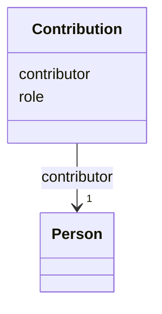

---
search:
  boost: 10.0
---

# Class: Contribution 


_Contributor role on a deliverable, CRediT-aligned where applicable._


<div data-search-exclude markdown="1">


URI: [core:Contribution](https://w3id.org/collabri/core/Contribution)





<!-- no inheritance hierarchy -->

## Slots

| Name | Cardinality and Range | Description | Inheritance |
| ---  | --- | --- | --- |
| [contributor](contributor.md) | 1 <br/> [Person](Person.md) | Person who made the contribution | direct |
| [role](role.md) | 0..1 <br/> [String](String.md) | CRediT contributor role (e | direct |


## Usages

| used by | used in | type | used |
| ---  | --- | --- | --- |
| [Deliverable](Deliverable.md) | [contributors](contributors.md) | range | [Contribution](Contribution.md) |
| [Activity](Activity.md) | [contributors](contributors.md) | range | [Contribution](Contribution.md) |
| [Data](Data.md) | [contributors](contributors.md) | range | [Contribution](Contribution.md) |
| [Method](Method.md) | [contributors](contributors.md) | range | [Contribution](Contribution.md) |
| [NarrativeDocument](NarrativeDocument.md) | [contributors](contributors.md) | range | [Contribution](Contribution.md) |
| [Software](Software.md) | [contributors](contributors.md) | range | [Contribution](Contribution.md) |
| [Standard](Standard.md) | [contributors](contributors.md) | range | [Contribution](Contribution.md) |


## Identifier and Mapping Information


### Schema Source


* from schema: https://w3id.org/collabri/core


## Mappings

| Mapping Type | Mapped Value |
| ---  | ---  |
| self | core:Contribution |
| native | core:Contribution |


## LinkML Source

<!-- TODO: investigate https://stackoverflow.com/questions/37606292/how-to-create-tabbed-code-blocks-in-mkdocs-or-sphinx -->

### Direct

<details>
```yaml
name: Contribution
description: Contributor role on a deliverable, CRediT-aligned where applicable.
from_schema: https://w3id.org/collabri/core
attributes:
  contributor:
    name: contributor
    description: Person who made the contribution.
    in_subset:
    - execution_tracking
    from_schema: https://w3id.org/collabri/core
    rank: 1000
    domain_of:
    - Contribution
    range: Person
    required: true
  role:
    name: role
    description: CRediT contributor role (e.g. "writing - original draft").
    in_subset:
    - execution_tracking
    from_schema: https://w3id.org/collabri/core
    close_mappings:
    - credit:writing-original-draft
    domain_of:
    - Party
    - Contribution

```
</details>

### Induced

<details>
```yaml
name: Contribution
description: Contributor role on a deliverable, CRediT-aligned where applicable.
from_schema: https://w3id.org/collabri/core
attributes:
  contributor:
    name: contributor
    description: Person who made the contribution.
    in_subset:
    - execution_tracking
    from_schema: https://w3id.org/collabri/core
    rank: 1000
    owner: Contribution
    domain_of:
    - Contribution
    range: Person
    required: true
  role:
    name: role
    description: CRediT contributor role (e.g. "writing - original draft").
    in_subset:
    - execution_tracking
    from_schema: https://w3id.org/collabri/core
    close_mappings:
    - credit:writing-original-draft
    owner: Contribution
    domain_of:
    - Party
    - Contribution
    range: string

```
</details></div>