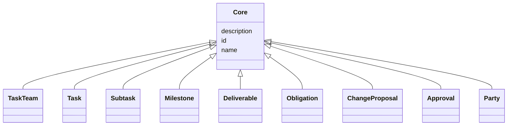

---
search:
  boost: 10.0
---

# Class: Core 


_Foundational base class for every addressable Collabri element. Provides id / name / description. Renamed from sow's "NamedThing" to match the Collabri-core schema name._


<div data-search-exclude markdown="1">


* __NOTE__: this is an abstract class and should not be instantiated directly


URI: [core:Core](https://w3id.org/collabri/core/Core)





## Inheritance
* **Core**
    * [TaskTeam](TaskTeam.md) [ [Versioned](Versioned.md) [Trackable](Trackable.md)]
    * [Task](Task.md) [ [Versioned](Versioned.md) [Trackable](Trackable.md)]
    * [Subtask](Subtask.md) [ [Versioned](Versioned.md) [Trackable](Trackable.md)]
    * [Milestone](Milestone.md) [ [Versioned](Versioned.md) [Trackable](Trackable.md)]
    * [Deliverable](Deliverable.md) [ [Versioned](Versioned.md) [Trackable](Trackable.md)]
    * [Obligation](Obligation.md)
    * [ChangeProposal](ChangeProposal.md)
    * [Approval](Approval.md)
    * [Party](Party.md)


## Slots

| Name | Cardinality and Range | Description | Inheritance |
| ---  | --- | --- | --- |
| [id](id.md) | 1 <br/> [String](String.md) | Stable identifier; together with version forms the element IRI | direct |
| [name](name.md) | 1 <br/> [String](String.md) | Human-readable name | direct |
| [description](description.md) | 0..1 <br/> [String](String.md) | Narrative description | direct |


## Identifier and Mapping Information


### Schema Source


* from schema: https://w3id.org/collabri/core


## Mappings

| Mapping Type | Mapped Value |
| ---  | ---  |
| self | core:Core |
| native | core:Core |


## LinkML Source

<!-- TODO: investigate https://stackoverflow.com/questions/37606292/how-to-create-tabbed-code-blocks-in-mkdocs-or-sphinx -->

### Direct

<details>
```yaml
name: Core
description: Foundational base class for every addressable Collabri element. Provides
  id / name / description. Renamed from sow's "NamedThing" to match the Collabri-core
  schema name.
from_schema: https://w3id.org/collabri/core
abstract: true
slots:
- id
- name
- description

```
</details>

### Induced

<details>
```yaml
name: Core
description: Foundational base class for every addressable Collabri element. Provides
  id / name / description. Renamed from sow's "NamedThing" to match the Collabri-core
  schema name.
from_schema: https://w3id.org/collabri/core
abstract: true
attributes:
  id:
    name: id
    description: Stable identifier; together with version forms the element IRI.
    in_subset:
    - sow_spec
    - execution_tracking
    from_schema: https://w3id.org/collabri/core
    exact_mappings:
    - schema:identifier
    rank: 1000
    slot_uri: dcterms:identifier
    identifier: true
    owner: Core
    domain_of:
    - Core
    - Change
    - Organization
    - Person
    range: string
    required: true
  name:
    name: name
    description: Human-readable name.
    in_subset:
    - sow_spec
    - execution_tracking
    from_schema: https://w3id.org/collabri/core
    exact_mappings:
    - dcterms:title
    - foaf:name
    rank: 1000
    slot_uri: schema:name
    owner: Core
    domain_of:
    - Core
    - Metric
    - Organization
    - Person
    range: string
    required: true
  description:
    name: description
    description: Narrative description.
    in_subset:
    - sow_spec
    - execution_tracking
    from_schema: https://w3id.org/collabri/core
    exact_mappings:
    - schema:description
    rank: 1000
    slot_uri: dcterms:description
    owner: Core
    domain_of:
    - Core
    range: string

```
</details></div>