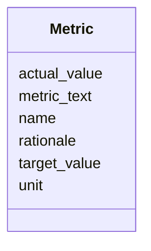

---
search:
  boost: 10.0
---

# Class: Metric 


_A measurable indicator used to evaluate a deliverable, together with the rationale for why this specific metric was selected. The Metric may carry a verbatim free-text statement (metric_text) when the SOW source has not yet broken metrics down into structured fields._


<div data-search-exclude markdown="1">


URI: [core:Metric](https://w3id.org/collabri/core/Metric)





<!-- no inheritance hierarchy -->

## Slots

| Name | Cardinality and Range | Description | Inheritance |
| ---  | --- | --- | --- |
| [name](name.md) | 0..1 <br/> [String](String.md) | Short name of the metric | direct |
| [metric_text](metric_text.md) | 0..1 <br/> [String](String.md) | Free-text fallback carrying the metric's verbatim statement from the source S... | direct |
| [target_value](target_value.md) | 0..1 <br/> [String](String.md) | The target value to be achieved | direct |
| [actual_value](actual_value.md) | 0..1 <br/> [String](String.md) | The observed / current value, when known | direct |
| [unit](unit.md) | 0..1 <br/> [String](String.md) | Unit of measure for the target and actual values | direct |
| [rationale](rationale.md) | 1 <br/> [String](String.md) | Per-metric rationale: why this specific metric was chosen and how it evidence... | direct |


## Usages

| used by | used in | type | used |
| ---  | --- | --- | --- |
| [Deliverable](Deliverable.md) | [metrics](metrics.md) | range | [Metric](Metric.md) |
| [Activity](Activity.md) | [metrics](metrics.md) | range | [Metric](Metric.md) |
| [Data](Data.md) | [metrics](metrics.md) | range | [Metric](Metric.md) |
| [Method](Method.md) | [metrics](metrics.md) | range | [Metric](Metric.md) |
| [NarrativeDocument](NarrativeDocument.md) | [metrics](metrics.md) | range | [Metric](Metric.md) |
| [Software](Software.md) | [metrics](metrics.md) | range | [Metric](Metric.md) |
| [Standard](Standard.md) | [metrics](metrics.md) | range | [Metric](Metric.md) |


## Identifier and Mapping Information


### Schema Source


* from schema: https://w3id.org/collabri/core


## Mappings

| Mapping Type | Mapped Value |
| ---  | ---  |
| self | core:Metric |
| native | core:Metric |
| related | qudt:Quantity |
| close | schema:PropertyValue |


## LinkML Source

<!-- TODO: investigate https://stackoverflow.com/questions/37606292/how-to-create-tabbed-code-blocks-in-mkdocs-or-sphinx -->

### Direct

<details>
```yaml
name: Metric
description: A measurable indicator used to evaluate a deliverable, together with
  the rationale for why this specific metric was selected. The Metric may carry a
  verbatim free-text statement (metric_text) when the SOW source has not yet broken
  metrics down into structured fields.
from_schema: https://w3id.org/collabri/core
close_mappings:
- schema:PropertyValue
related_mappings:
- qudt:Quantity
attributes:
  name:
    name: name
    description: Short name of the metric.
    in_subset:
    - sow_spec
    - execution_tracking
    from_schema: https://w3id.org/collabri/core
    domain_of:
    - Core
    - Metric
    - Organization
    - Person
  metric_text:
    name: metric_text
    description: Free-text fallback carrying the metric's verbatim statement from
      the source SOW, when the metric is not yet broken into structured name/target/unit
      fields.
    in_subset:
    - sow_spec
    - execution_tracking
    from_schema: https://w3id.org/collabri/core
    close_mappings:
    - dcterms:description
    rank: 1000
    domain_of:
    - Metric
  target_value:
    name: target_value
    description: The target value to be achieved.
    in_subset:
    - sow_spec
    - execution_tracking
    from_schema: https://w3id.org/collabri/core
    rank: 1000
    slot_uri: qudt:value
    domain_of:
    - Metric
  actual_value:
    name: actual_value
    description: The observed / current value, when known.
    in_subset:
    - execution_tracking
    from_schema: https://w3id.org/collabri/core
    close_mappings:
    - qudt:value
    - schema:value
    rank: 1000
    domain_of:
    - Metric
  unit:
    name: unit
    description: Unit of measure for the target and actual values.
    in_subset:
    - sow_spec
    - execution_tracking
    from_schema: https://w3id.org/collabri/core
    rank: 1000
    slot_uri: qudt:hasUnit
    domain_of:
    - Metric
  rationale:
    name: rationale
    description: 'Per-metric rationale: why this specific metric was chosen and how
      it evidences successful delivery.'
    in_subset:
    - sow_spec
    - execution_tracking
    from_schema: https://w3id.org/collabri/core
    close_mappings:
    - dcterms:description
    - skos:scopeNote
    domain_of:
    - AcceptanceCriterion
    - Metric
    required: true

```
</details>

### Induced

<details>
```yaml
name: Metric
description: A measurable indicator used to evaluate a deliverable, together with
  the rationale for why this specific metric was selected. The Metric may carry a
  verbatim free-text statement (metric_text) when the SOW source has not yet broken
  metrics down into structured fields.
from_schema: https://w3id.org/collabri/core
close_mappings:
- schema:PropertyValue
related_mappings:
- qudt:Quantity
attributes:
  name:
    name: name
    description: Short name of the metric.
    in_subset:
    - sow_spec
    - execution_tracking
    from_schema: https://w3id.org/collabri/core
    owner: Metric
    domain_of:
    - Core
    - Metric
    - Organization
    - Person
    range: string
  metric_text:
    name: metric_text
    description: Free-text fallback carrying the metric's verbatim statement from
      the source SOW, when the metric is not yet broken into structured name/target/unit
      fields.
    in_subset:
    - sow_spec
    - execution_tracking
    from_schema: https://w3id.org/collabri/core
    close_mappings:
    - dcterms:description
    rank: 1000
    owner: Metric
    domain_of:
    - Metric
    range: string
  target_value:
    name: target_value
    description: The target value to be achieved.
    in_subset:
    - sow_spec
    - execution_tracking
    from_schema: https://w3id.org/collabri/core
    rank: 1000
    slot_uri: qudt:value
    owner: Metric
    domain_of:
    - Metric
    range: string
  actual_value:
    name: actual_value
    description: The observed / current value, when known.
    in_subset:
    - execution_tracking
    from_schema: https://w3id.org/collabri/core
    close_mappings:
    - qudt:value
    - schema:value
    rank: 1000
    owner: Metric
    domain_of:
    - Metric
    range: string
  unit:
    name: unit
    description: Unit of measure for the target and actual values.
    in_subset:
    - sow_spec
    - execution_tracking
    from_schema: https://w3id.org/collabri/core
    rank: 1000
    slot_uri: qudt:hasUnit
    owner: Metric
    domain_of:
    - Metric
    range: string
  rationale:
    name: rationale
    description: 'Per-metric rationale: why this specific metric was chosen and how
      it evidences successful delivery.'
    in_subset:
    - sow_spec
    - execution_tracking
    from_schema: https://w3id.org/collabri/core
    close_mappings:
    - dcterms:description
    - skos:scopeNote
    owner: Metric
    domain_of:
    - AcceptanceCriterion
    - Metric
    range: string
    required: true

```
</details></div>