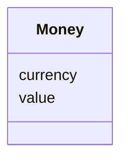

---
search:
  boost: 10.0
---

# Class: Money 


_A monetary amount with currency. Reuses schema:MonetaryAmount directly._


<div data-search-exclude markdown="1">


URI: [schema:MonetaryAmount](http://schema.org/MonetaryAmount)





<!-- no inheritance hierarchy -->

## Class Properties

| Property | Value |
| --- | --- |
| Class URI | [schema:MonetaryAmount](http://schema.org/MonetaryAmount) |


## Slots

| Name | Cardinality and Range | Description | Inheritance |
| ---  | --- | --- | --- |
| [value](value.md) | 1 <br/> [Decimal](Decimal.md) | The numeric amount | direct |
| [currency](currency.md) | 0..1 <br/> [String](String.md) | ISO 4217 currency code | direct |


## Usages

| used by | used in | type | used |
| ---  | --- | --- | --- |
| [TaskTeam](TaskTeam.md) | [contract_value](contract_value.md) | range | [Money](Money.md) |
| [Payment](Payment.md) | [planned_amount](planned_amount.md) | range | [Money](Money.md) |
| [BudgetEntry](BudgetEntry.md) | [amount](amount.md) | range | [Money](Money.md) |


## Identifier and Mapping Information


### Schema Source


* from schema: https://w3id.org/collabri/core


## Mappings

| Mapping Type | Mapped Value |
| ---  | ---  |
| self | schema:MonetaryAmount |
| native | core:Money |
| close | fibo_acc:MonetaryAmount, gist:MonetaryAmount |


## LinkML Source

<!-- TODO: investigate https://stackoverflow.com/questions/37606292/how-to-create-tabbed-code-blocks-in-mkdocs-or-sphinx -->

### Direct

<details>
```yaml
name: Money
description: A monetary amount with currency. Reuses schema:MonetaryAmount directly.
from_schema: https://w3id.org/collabri/core
close_mappings:
- fibo_acc:MonetaryAmount
- gist:MonetaryAmount
attributes:
  value:
    name: value
    description: The numeric amount.
    from_schema: https://w3id.org/collabri/core
    rank: 1000
    slot_uri: schema:value
    domain_of:
    - Money
    range: decimal
    required: true
    minimum_value: 0
  currency:
    name: currency
    description: ISO 4217 currency code.
    from_schema: https://w3id.org/collabri/core
    rank: 1000
    slot_uri: schema:currency
    ifabsent: string(USD)
    domain_of:
    - Money
    pattern: ^[A-Z]{3}$
class_uri: schema:MonetaryAmount

```
</details>

### Induced

<details>
```yaml
name: Money
description: A monetary amount with currency. Reuses schema:MonetaryAmount directly.
from_schema: https://w3id.org/collabri/core
close_mappings:
- fibo_acc:MonetaryAmount
- gist:MonetaryAmount
attributes:
  value:
    name: value
    description: The numeric amount.
    from_schema: https://w3id.org/collabri/core
    rank: 1000
    slot_uri: schema:value
    owner: Money
    domain_of:
    - Money
    range: decimal
    required: true
    minimum_value: 0
  currency:
    name: currency
    description: ISO 4217 currency code.
    from_schema: https://w3id.org/collabri/core
    rank: 1000
    slot_uri: schema:currency
    ifabsent: string(USD)
    owner: Money
    domain_of:
    - Money
    range: string
    pattern: ^[A-Z]{3}$
class_uri: schema:MonetaryAmount

```
</details></div>