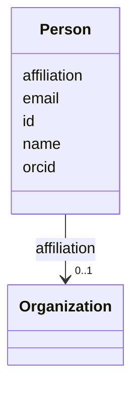

---
search:
  boost: 10.0
---

# Class: Person 


_A person who can be assigned as a lead or contributor._


<div data-search-exclude markdown="1">


URI: [cco:ont00001262](https://www.commoncoreontologies.org/ont00001262)





<!-- no inheritance hierarchy -->

## Class Properties

| Property | Value |
| --- | --- |
| Class URI | [cco:ont00001262](https://www.commoncoreontologies.org/ont00001262) |


## Slots

| Name | Cardinality and Range | Description | Inheritance |
| ---  | --- | --- | --- |
| [id](id.md) | 1 <br/> [String](String.md) |  | direct |
| [name](name.md) | 1 <br/> [String](String.md) | Full name | direct |
| [email](email.md) | 0..1 <br/> [String](String.md) | Contact email | direct |
| [orcid](orcid.md) | 0..1 <br/> [String](String.md) | ORCID identifier | direct |
| [affiliation](affiliation.md) | 0..1 <br/> [Organization](Organization.md) | The organization this person belongs to | direct |


## Usages

| used by | used in | type | used |
| ---  | --- | --- | --- |
| [TaskTeam](TaskTeam.md) | [persons](persons.md) | range | [Person](Person.md) |
| [Subtask](Subtask.md) | [leads](leads.md) | range | [Person](Person.md) |
| [Approval](Approval.md) | [approver](approver.md) | range | [Person](Person.md) |
| [Contribution](Contribution.md) | [contributor](contributor.md) | range | [Person](Person.md) |


## Identifier and Mapping Information


### Schema Source


* from schema: https://w3id.org/collabri/core


## Mappings

| Mapping Type | Mapped Value |
| ---  | ---  |
| self | cco:ont00001262 |
| native | core:Person |
| exact | foaf:Person, schema:Person, prov:Person |


## LinkML Source

<!-- TODO: investigate https://stackoverflow.com/questions/37606292/how-to-create-tabbed-code-blocks-in-mkdocs-or-sphinx -->

### Direct

<details>
```yaml
name: Person
description: A person who can be assigned as a lead or contributor.
from_schema: https://w3id.org/collabri/core
exact_mappings:
- foaf:Person
- schema:Person
- prov:Person
attributes:
  id:
    name: id
    from_schema: https://w3id.org/collabri/core
    slot_uri: dcterms:identifier
    identifier: true
    domain_of:
    - Core
    - Change
    - Organization
    - Person
    required: true
  name:
    name: name
    description: Full name.
    from_schema: https://w3id.org/collabri/core
    slot_uri: schema:name
    domain_of:
    - Core
    - Metric
    - Organization
    - Person
    required: true
  email:
    name: email
    description: Contact email.
    from_schema: https://w3id.org/collabri/core
    exact_mappings:
    - foaf:mbox
    rank: 1000
    slot_uri: schema:email
    domain_of:
    - Person
    pattern: ^\S+@\S+\.\S+$
  orcid:
    name: orcid
    description: ORCID identifier.
    in_subset:
    - sow_spec
    - execution_tracking
    from_schema: https://w3id.org/collabri/core
    rank: 1000
    slot_uri: schema:identifier
    domain_of:
    - Person
  affiliation:
    name: affiliation
    description: The organization this person belongs to.
    in_subset:
    - sow_spec
    - execution_tracking
    from_schema: https://w3id.org/collabri/core
    rank: 1000
    slot_uri: schema:affiliation
    domain_of:
    - Person
    range: Organization
class_uri: cco:ont00001262

```
</details>

### Induced

<details>
```yaml
name: Person
description: A person who can be assigned as a lead or contributor.
from_schema: https://w3id.org/collabri/core
exact_mappings:
- foaf:Person
- schema:Person
- prov:Person
attributes:
  id:
    name: id
    from_schema: https://w3id.org/collabri/core
    slot_uri: dcterms:identifier
    identifier: true
    owner: Person
    domain_of:
    - Core
    - Change
    - Organization
    - Person
    range: string
    required: true
  name:
    name: name
    description: Full name.
    from_schema: https://w3id.org/collabri/core
    slot_uri: schema:name
    owner: Person
    domain_of:
    - Core
    - Metric
    - Organization
    - Person
    range: string
    required: true
  email:
    name: email
    description: Contact email.
    from_schema: https://w3id.org/collabri/core
    exact_mappings:
    - foaf:mbox
    rank: 1000
    slot_uri: schema:email
    owner: Person
    domain_of:
    - Person
    range: string
    pattern: ^\S+@\S+\.\S+$
  orcid:
    name: orcid
    description: ORCID identifier.
    in_subset:
    - sow_spec
    - execution_tracking
    from_schema: https://w3id.org/collabri/core
    rank: 1000
    slot_uri: schema:identifier
    owner: Person
    domain_of:
    - Person
    range: string
  affiliation:
    name: affiliation
    description: The organization this person belongs to.
    in_subset:
    - sow_spec
    - execution_tracking
    from_schema: https://w3id.org/collabri/core
    rank: 1000
    slot_uri: schema:affiliation
    owner: Person
    domain_of:
    - Person
    range: Organization
class_uri: cco:ont00001262

```
</details></div>