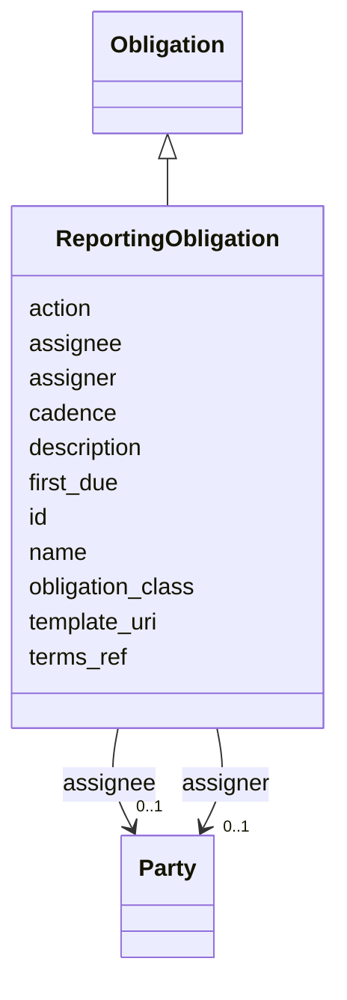

---
search:
  boost: 10.0
---

# Class: ReportingObligation 


_Recurring reporting duty (quarterly progress report, annual technical report, etc.)._


<div data-search-exclude markdown="1">


URI: [core:ReportingObligation](https://w3id.org/collabri/core/ReportingObligation)





## Inheritance
* [Core](Core.md)
    * [Obligation](Obligation.md)
        * **ReportingObligation**


## Slots

| Name | Cardinality and Range | Description | Inheritance |
| ---  | --- | --- | --- |
| [cadence](cadence.md) | 0..1 <br/> [String](String.md) | Reporting cadence (e | direct |
| [first_due](first_due.md) | 0..1 <br/> [Integer](Integer.md) | First due-month for the recurring report | direct |
| [template_uri](template_uri.md) | 0..1 <br/> [String](String.md) | Pointer to the required reporting template, if any | direct |
| [obligation_class](obligation_class.md) | 0..1 <br/> [String](String.md) | Discriminator for the concrete Obligation subclass | [Obligation](Obligation.md) |
| [assigner](assigner.md) | 0..1 <br/> [Party](Party.md) | Party imposing the obligation | [Obligation](Obligation.md) |
| [assignee](assignee.md) | 0..1 <br/> [Party](Party.md) | Party bound by the obligation | [Obligation](Obligation.md) |
| [action](action.md) | 0..1 <br/> [String](String.md) | ODRL action term or local action label (e | [Obligation](Obligation.md) |
| [terms_ref](terms_ref.md) | 0..1 <br/> [String](String.md) | Pointer to the governing contract clause | [Obligation](Obligation.md) |
| [id](id.md) | 1 <br/> [String](String.md) | Stable identifier; together with version forms the element IRI | [Core](Core.md) |
| [name](name.md) | 1 <br/> [String](String.md) | Human-readable name | [Core](Core.md) |
| [description](description.md) | 0..1 <br/> [String](String.md) | Narrative description | [Core](Core.md) |


## Identifier and Mapping Information


### Schema Source


* from schema: https://w3id.org/collabri/core


## Mappings

| Mapping Type | Mapped Value |
| ---  | ---  |
| self | core:ReportingObligation |
| native | core:ReportingObligation |


## LinkML Source

<!-- TODO: investigate https://stackoverflow.com/questions/37606292/how-to-create-tabbed-code-blocks-in-mkdocs-or-sphinx -->

### Direct

<details>
```yaml
name: ReportingObligation
description: Recurring reporting duty (quarterly progress report, annual technical
  report, etc.).
from_schema: https://w3id.org/collabri/core
is_a: Obligation
attributes:
  cadence:
    name: cadence
    description: Reporting cadence (e.g. "quarterly", "annually").
    in_subset:
    - sow_spec
    - execution_tracking
    from_schema: https://w3id.org/collabri/core
    rank: 1000
    domain_of:
    - ReportingObligation
  first_due:
    name: first_due
    description: First due-month for the recurring report.
    in_subset:
    - sow_spec
    - execution_tracking
    from_schema: https://w3id.org/collabri/core
    rank: 1000
    domain_of:
    - ReportingObligation
    range: integer
    minimum_value: 1
  template_uri:
    name: template_uri
    description: Pointer to the required reporting template, if any.
    in_subset:
    - sow_spec
    - execution_tracking
    from_schema: https://w3id.org/collabri/core
    rank: 1000
    domain_of:
    - ReportingObligation

```
</details>

### Induced

<details>
```yaml
name: ReportingObligation
description: Recurring reporting duty (quarterly progress report, annual technical
  report, etc.).
from_schema: https://w3id.org/collabri/core
is_a: Obligation
attributes:
  cadence:
    name: cadence
    description: Reporting cadence (e.g. "quarterly", "annually").
    in_subset:
    - sow_spec
    - execution_tracking
    from_schema: https://w3id.org/collabri/core
    rank: 1000
    owner: ReportingObligation
    domain_of:
    - ReportingObligation
    range: string
  first_due:
    name: first_due
    description: First due-month for the recurring report.
    in_subset:
    - sow_spec
    - execution_tracking
    from_schema: https://w3id.org/collabri/core
    rank: 1000
    owner: ReportingObligation
    domain_of:
    - ReportingObligation
    range: integer
    minimum_value: 1
  template_uri:
    name: template_uri
    description: Pointer to the required reporting template, if any.
    in_subset:
    - sow_spec
    - execution_tracking
    from_schema: https://w3id.org/collabri/core
    rank: 1000
    owner: ReportingObligation
    domain_of:
    - ReportingObligation
    range: string
  obligation_class:
    name: obligation_class
    description: Discriminator for the concrete Obligation subclass.
    in_subset:
    - sow_spec
    - execution_tracking
    from_schema: https://w3id.org/collabri/core
    rank: 1000
    owner: ReportingObligation
    domain_of:
    - Obligation
    range: string
  assigner:
    name: assigner
    description: Party imposing the obligation.
    in_subset:
    - sow_spec
    - execution_tracking
    from_schema: https://w3id.org/collabri/core
    rank: 1000
    slot_uri: odrl:assigner
    owner: ReportingObligation
    domain_of:
    - Obligation
    range: Party
  assignee:
    name: assignee
    description: Party bound by the obligation.
    in_subset:
    - sow_spec
    - execution_tracking
    from_schema: https://w3id.org/collabri/core
    rank: 1000
    slot_uri: odrl:assignee
    owner: ReportingObligation
    domain_of:
    - Obligation
    range: Party
  action:
    name: action
    description: ODRL action term or local action label (e.g. "report", "deliver",
      "pay").
    in_subset:
    - sow_spec
    - execution_tracking
    from_schema: https://w3id.org/collabri/core
    rank: 1000
    slot_uri: odrl:action
    owner: ReportingObligation
    domain_of:
    - Obligation
    range: string
  terms_ref:
    name: terms_ref
    description: Pointer to the governing contract clause.
    in_subset:
    - sow_spec
    - execution_tracking
    from_schema: https://w3id.org/collabri/core
    rank: 1000
    owner: ReportingObligation
    domain_of:
    - Obligation
    range: string
  id:
    name: id
    description: Stable identifier; together with version forms the element IRI.
    in_subset:
    - sow_spec
    - execution_tracking
    from_schema: https://w3id.org/collabri/core
    exact_mappings:
    - schema:identifier
    rank: 1000
    slot_uri: dcterms:identifier
    identifier: true
    owner: ReportingObligation
    domain_of:
    - Core
    - Change
    - Organization
    - Person
    range: string
    required: true
  name:
    name: name
    description: Human-readable name.
    in_subset:
    - sow_spec
    - execution_tracking
    from_schema: https://w3id.org/collabri/core
    exact_mappings:
    - dcterms:title
    - foaf:name
    rank: 1000
    slot_uri: schema:name
    owner: ReportingObligation
    domain_of:
    - Core
    - Metric
    - Organization
    - Person
    range: string
    required: true
  description:
    name: description
    description: Narrative description.
    in_subset:
    - sow_spec
    - execution_tracking
    from_schema: https://w3id.org/collabri/core
    exact_mappings:
    - schema:description
    rank: 1000
    slot_uri: dcterms:description
    owner: ReportingObligation
    domain_of:
    - Core
    range: string

```
</details></div>