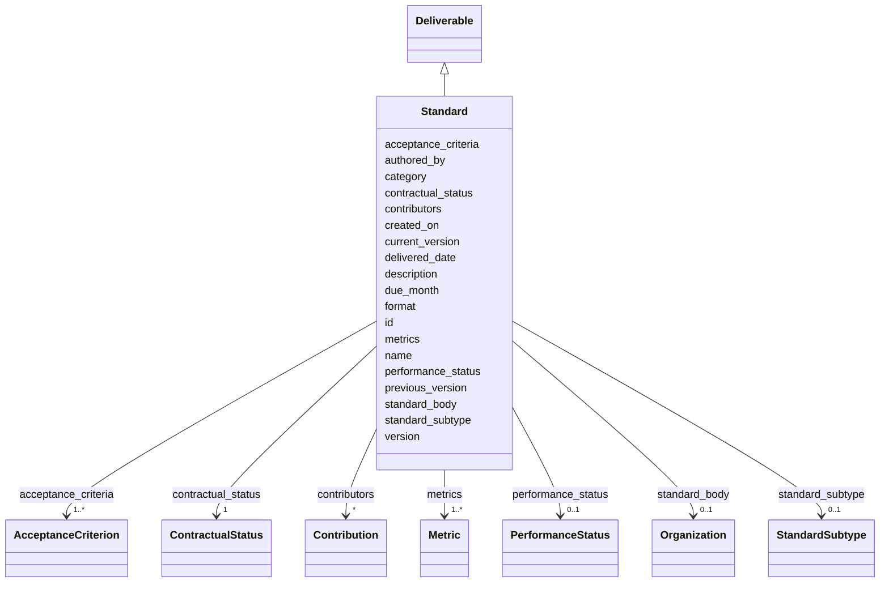

---
search:
  boost: 10.0
---

# Class: Standard 


_A normative or internal standard, classified by subtype._


<div data-search-exclude markdown="1">


URI: [core:Standard](https://w3id.org/collabri/core/Standard)





## Inheritance
* [Core](Core.md)
    * [Deliverable](Deliverable.md) [ [Versioned](Versioned.md) [Trackable](Trackable.md)]
        * **Standard**


## Slots

| Name | Cardinality and Range | Description | Inheritance |
| ---  | --- | --- | --- |
| [standard_subtype](standard_subtype.md) | 0..1 <br/> [StandardSubtype](StandardSubtype.md) | Kind of standard (ADMS-aligned) | direct |
| [standard_body](standard_body.md) | 0..1 <br/> [Organization](Organization.md) | Organization stewarding the standard, if external | direct |
| [category](category.md) | 1 <br/> [String](String.md) | Discriminator naming the concrete Deliverable subclass for this instance | [Deliverable](Deliverable.md) |
| [acceptance_criteria](acceptance_criteria.md) | 1..* <br/> [AcceptanceCriterion](AcceptanceCriterion.md) | The condition(s) that must be met for this deliverable to be accepted | [Deliverable](Deliverable.md) |
| [metrics](metrics.md) | 1..* <br/> [Metric](Metric.md) | The metric(s) by which this deliverable is evaluated | [Deliverable](Deliverable.md) |
| [due_month](due_month.md) | 0..1 <br/> [Integer](Integer.md) | Optional deliverable-specific due month | [Deliverable](Deliverable.md) |
| [contributors](contributors.md) | * <br/> [Contribution](Contribution.md) | Per-deliverable contributor roles (CRediT-aligned) | [Deliverable](Deliverable.md) |
| [format](format.md) | 0..1 <br/> [String](String.md) | Delivery format (PDF, repository, briefing, etc | [Deliverable](Deliverable.md) |
| [delivered_date](delivered_date.md) | 0..1 <br/> [Date](Date.md) | Date the deliverable was actually delivered | [Deliverable](Deliverable.md) |
| [version](version.md) | 0..1 <br/> [String](String.md) | Semantic version of this element | [Versioned](Versioned.md) |
| [previous_version](previous_version.md) | 0..1 <br/> [Uriorcurie](Uriorcurie.md) | IRI of the immediately prior version of this element | [Versioned](Versioned.md) |
| [current_version](current_version.md) | 0..1 <br/> [Boolean](Boolean.md) | True iff this is the current accepted version of the element | [Versioned](Versioned.md) |
| [created_on](created_on.md) | 0..1 <br/> [Date](Date.md) | Date this version snapshot was created | [Versioned](Versioned.md) |
| [authored_by](authored_by.md) | * <br/> [Uriorcurie](Uriorcurie.md) | Author(s) of this version snapshot | [Versioned](Versioned.md) |
| [contractual_status](contractual_status.md) | 1 <br/> [ContractualStatus](ContractualStatus.md) | Where this element sits in the contract lifecycle | [Trackable](Trackable.md) |
| [performance_status](performance_status.md) | 0..1 <br/> [PerformanceStatus](PerformanceStatus.md) | Execution state, orthogonal to contractual_status | [Trackable](Trackable.md) |
| [id](id.md) | 1 <br/> [String](String.md) | Stable identifier; together with version forms the element IRI | [Core](Core.md) |
| [name](name.md) | 1 <br/> [String](String.md) | Human-readable name | [Core](Core.md) |
| [description](description.md) | 0..1 <br/> [String](String.md) | Narrative description | [Core](Core.md) |


## Identifier and Mapping Information


### Schema Source


* from schema: https://w3id.org/collabri/core


## Mappings

| Mapping Type | Mapped Value |
| ---  | ---  |
| self | core:Standard |
| native | core:Standard |
| close | adms:Asset |


## LinkML Source

<!-- TODO: investigate https://stackoverflow.com/questions/37606292/how-to-create-tabbed-code-blocks-in-mkdocs-or-sphinx -->

### Direct

<details>
```yaml
name: Standard
description: A normative or internal standard, classified by subtype.
from_schema: https://w3id.org/collabri/core
close_mappings:
- adms:Asset
is_a: Deliverable
attributes:
  standard_subtype:
    name: standard_subtype
    description: Kind of standard (ADMS-aligned).
    in_subset:
    - sow_spec
    - execution_tracking
    from_schema: https://w3id.org/collabri/core
    rank: 1000
    domain_of:
    - Standard
    range: StandardSubtype
  standard_body:
    name: standard_body
    description: Organization stewarding the standard, if external.
    in_subset:
    - sow_spec
    - execution_tracking
    from_schema: https://w3id.org/collabri/core
    rank: 1000
    domain_of:
    - Standard
    range: Organization

```
</details>

### Induced

<details>
```yaml
name: Standard
description: A normative or internal standard, classified by subtype.
from_schema: https://w3id.org/collabri/core
close_mappings:
- adms:Asset
is_a: Deliverable
attributes:
  standard_subtype:
    name: standard_subtype
    description: Kind of standard (ADMS-aligned).
    in_subset:
    - sow_spec
    - execution_tracking
    from_schema: https://w3id.org/collabri/core
    rank: 1000
    owner: Standard
    domain_of:
    - Standard
    range: StandardSubtype
  standard_body:
    name: standard_body
    description: Organization stewarding the standard, if external.
    in_subset:
    - sow_spec
    - execution_tracking
    from_schema: https://w3id.org/collabri/core
    rank: 1000
    owner: Standard
    domain_of:
    - Standard
    range: Organization
  category:
    name: category
    description: Discriminator naming the concrete Deliverable subclass for this instance.
      Required because Deliverable is abstract; every instance must declare which
      typed subclass it is (Activity, Data, Method, NarrativeDocument, Software, Standard).
    in_subset:
    - sow_spec
    - execution_tracking
    from_schema: https://w3id.org/collabri/core
    rank: 1000
    designates_type: true
    owner: Standard
    domain_of:
    - Deliverable
    range: string
    required: true
  acceptance_criteria:
    name: acceptance_criteria
    description: The condition(s) that must be met for this deliverable to be accepted.
      Required at 1.0; structured list of testable AcceptanceCriterion.
    in_subset:
    - sow_spec
    - execution_tracking
    from_schema: https://w3id.org/collabri/core
    rank: 1000
    owner: Standard
    domain_of:
    - Deliverable
    range: AcceptanceCriterion
    required: true
    multivalued: true
    inlined: true
    inlined_as_list: true
  metrics:
    name: metrics
    description: The metric(s) by which this deliverable is evaluated.
    in_subset:
    - sow_spec
    - execution_tracking
    from_schema: https://w3id.org/collabri/core
    rank: 1000
    owner: Standard
    domain_of:
    - Deliverable
    range: Metric
    required: true
    multivalued: true
    inlined: true
    inlined_as_list: true
  due_month:
    name: due_month
    description: Optional deliverable-specific due month. If absent, the parent subtask's
      due_month governs.
    in_subset:
    - sow_spec
    - execution_tracking
    from_schema: https://w3id.org/collabri/core
    owner: Standard
    domain_of:
    - Subtask
    - Deliverable
    range: integer
    minimum_value: 1
  contributors:
    name: contributors
    description: Per-deliverable contributor roles (CRediT-aligned).
    in_subset:
    - execution_tracking
    from_schema: https://w3id.org/collabri/core
    rank: 1000
    owner: Standard
    domain_of:
    - Deliverable
    range: Contribution
    multivalued: true
    inlined: true
    inlined_as_list: true
  format:
    name: format
    description: Delivery format (PDF, repository, briefing, etc.).
    in_subset:
    - sow_spec
    - execution_tracking
    from_schema: https://w3id.org/collabri/core
    rank: 1000
    slot_uri: dcterms:format
    owner: Standard
    domain_of:
    - Deliverable
    range: string
  delivered_date:
    name: delivered_date
    description: Date the deliverable was actually delivered.
    in_subset:
    - execution_tracking
    from_schema: https://w3id.org/collabri/core
    rank: 1000
    owner: Standard
    domain_of:
    - Deliverable
    range: date
  version:
    name: version
    description: Semantic version of this element.
    in_subset:
    - sow_spec
    - execution_tracking
    from_schema: https://w3id.org/collabri/core
    rank: 1000
    slot_uri: pav:version
    owner: Standard
    domain_of:
    - Versioned
    range: string
  previous_version:
    name: previous_version
    description: IRI of the immediately prior version of this element.
    in_subset:
    - execution_tracking
    from_schema: https://w3id.org/collabri/core
    rank: 1000
    slot_uri: pav:previousVersion
    owner: Standard
    domain_of:
    - Versioned
    range: uriorcurie
  current_version:
    name: current_version
    description: True iff this is the current accepted version of the element.
    in_subset:
    - execution_tracking
    from_schema: https://w3id.org/collabri/core
    rank: 1000
    slot_uri: pav:hasCurrentVersion
    owner: Standard
    domain_of:
    - Versioned
    range: boolean
  created_on:
    name: created_on
    description: Date this version snapshot was created.
    in_subset:
    - sow_spec
    - execution_tracking
    from_schema: https://w3id.org/collabri/core
    rank: 1000
    slot_uri: pav:createdOn
    owner: Standard
    domain_of:
    - Versioned
    range: date
  authored_by:
    name: authored_by
    description: Author(s) of this version snapshot.
    in_subset:
    - sow_spec
    - execution_tracking
    from_schema: https://w3id.org/collabri/core
    rank: 1000
    slot_uri: pav:authoredBy
    owner: Standard
    domain_of:
    - Versioned
    range: uriorcurie
    multivalued: true
  contractual_status:
    name: contractual_status
    description: Where this element sits in the contract lifecycle.
    in_subset:
    - sow_spec
    - execution_tracking
    from_schema: https://w3id.org/collabri/core
    rank: 1000
    owner: Standard
    domain_of:
    - Trackable
    range: ContractualStatus
    required: true
  performance_status:
    name: performance_status
    description: Execution state, orthogonal to contractual_status.
    in_subset:
    - execution_tracking
    from_schema: https://w3id.org/collabri/core
    close_mappings:
    - schema:actionStatus
    rank: 1000
    owner: Standard
    domain_of:
    - Trackable
    range: PerformanceStatus
  id:
    name: id
    description: Stable identifier; together with version forms the element IRI.
    in_subset:
    - sow_spec
    - execution_tracking
    from_schema: https://w3id.org/collabri/core
    exact_mappings:
    - schema:identifier
    rank: 1000
    slot_uri: dcterms:identifier
    identifier: true
    owner: Standard
    domain_of:
    - Core
    - Change
    - Organization
    - Person
    range: string
    required: true
  name:
    name: name
    description: Human-readable name.
    in_subset:
    - sow_spec
    - execution_tracking
    from_schema: https://w3id.org/collabri/core
    exact_mappings:
    - dcterms:title
    - foaf:name
    rank: 1000
    slot_uri: schema:name
    owner: Standard
    domain_of:
    - Core
    - Metric
    - Organization
    - Person
    range: string
    required: true
  description:
    name: description
    description: Narrative description.
    in_subset:
    - sow_spec
    - execution_tracking
    from_schema: https://w3id.org/collabri/core
    exact_mappings:
    - schema:description
    rank: 1000
    slot_uri: dcterms:description
    owner: Standard
    domain_of:
    - Core
    range: string

```
</details></div>