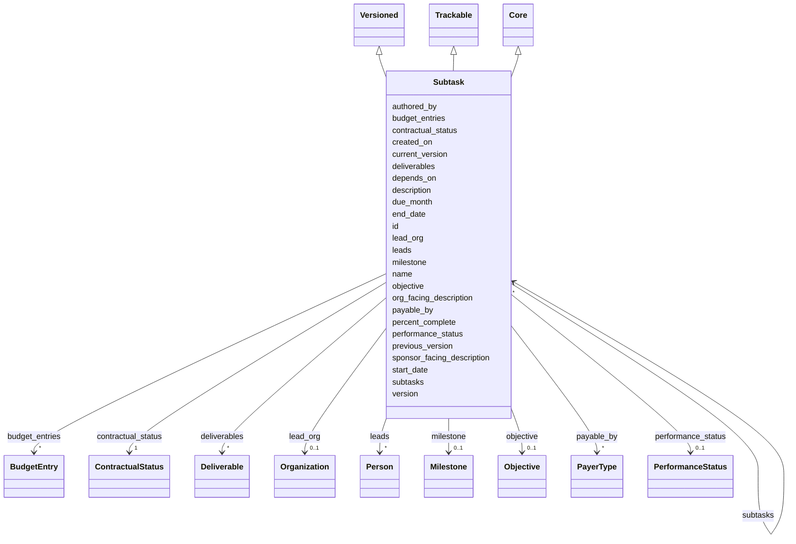

---
search:
  boost: 10.0
---

# Class: Subtask 


_A step toward completion of a Task. Subtasks nest recursively to arbitrary depth and are owned by exactly one TaskTeam (no shared ownership). Each subtask may be sponsor- and/or prime-payable; payment is triggered by acceptance of the referenced Milestone._

_Modeling note: Objective and Deliverable are deliberately distinct siblings on Subtask. Objective is the *aim* of the work; Deliverable is the *artifact* that fulfills the aim. Deliverable descriptions should not restate the objective._

_Audience narratives: description is the neutral narrative. sponsor_facing_description is the wording written for the sponsor and is the description a sponsor report prints. org_facing_description is the wording written for the performing organization when that wording differs. When an audience slot is omitted, readers use description. objective.notes is scope clarification, not either narrative._


<div data-search-exclude markdown="1">


URI: [frapo:Task](http://purl.org/cerif/frapo/Task)





## Inheritance
* [Core](Core.md)
    * **Subtask** [ [Versioned](Versioned.md) [Trackable](Trackable.md)]


## Class Properties

| Property | Value |
| --- | --- |
| Class URI | [frapo:Task](http://purl.org/cerif/frapo/Task) |


## Slots

| Name | Cardinality and Range | Description | Inheritance |
| ---  | --- | --- | --- |
| [objective](objective.md) | 0..1 <br/> [Objective](Objective.md) | The aim of this subtask — what success looks like, expressed once, independen... | direct |
| [sponsor_facing_description](sponsor_facing_description.md) | 0..1 <br/> [String](String.md) | Narrative of this subtask written for the sponsor | direct |
| [org_facing_description](org_facing_description.md) | 0..1 <br/> [String](String.md) | Narrative of this subtask written for the performing organization, when that ... | direct |
| [due_month](due_month.md) | 1 <br/> [Integer](Integer.md) | Due date expressed as a whole number of months since program start | direct |
| [start_date](start_date.md) | 0..1 <br/> [Date](Date.md) | Calendar start date for this subtask | direct |
| [end_date](end_date.md) | 0..1 <br/> [Date](Date.md) | Calendar end date for this subtask | direct |
| [percent_complete](percent_complete.md) | 0..1 <br/> [Float](Float.md) | For partial-completion payable subtasks (e | direct |
| [lead_org](lead_org.md) | 0..1 <br/> [Organization](Organization.md) | The organization accountable for delivering this subtask | direct |
| [leads](leads.md) | * <br/> [Person](Person.md) | The person or people leading this subtask | direct |
| [payable_by](payable_by.md) | * <br/> [PayerType](PayerType.md) | Which parties owe payment on acceptance of the milestone gating this subtask | direct |
| [milestone](milestone.md) | 0..1 <br/> [Milestone](Milestone.md) | Milestone whose acceptance gates contractual events (e | direct |
| [budget_entries](budget_entries.md) | * <br/> [BudgetEntry](BudgetEntry.md) | Datestamped budget snapshots for this subtask, covering the proposed / awarde... | direct |
| [deliverables](deliverables.md) | * <br/> [Deliverable](Deliverable.md) | Deliverables produced by this subtask | direct |
| [subtasks](subtasks.md) | * <br/> [Subtask](Subtask.md) | Nested sub-subtasks (arbitrary depth) | direct |
| [depends_on](depends_on.md) | * <br/> [Subtask](Subtask.md) | Other subtasks that must complete before this one can proceed | direct |
| [version](version.md) | 0..1 <br/> [String](String.md) | Semantic version of this element | [Versioned](Versioned.md) |
| [previous_version](previous_version.md) | 0..1 <br/> [Uriorcurie](Uriorcurie.md) | IRI of the immediately prior version of this element | [Versioned](Versioned.md) |
| [current_version](current_version.md) | 0..1 <br/> [Boolean](Boolean.md) | True iff this is the current accepted version of the element | [Versioned](Versioned.md) |
| [created_on](created_on.md) | 0..1 <br/> [Date](Date.md) | Date this version snapshot was created | [Versioned](Versioned.md) |
| [authored_by](authored_by.md) | * <br/> [Uriorcurie](Uriorcurie.md) | Author(s) of this version snapshot | [Versioned](Versioned.md) |
| [contractual_status](contractual_status.md) | 1 <br/> [ContractualStatus](ContractualStatus.md) | Where this element sits in the contract lifecycle | [Trackable](Trackable.md) |
| [performance_status](performance_status.md) | 0..1 <br/> [PerformanceStatus](PerformanceStatus.md) | Execution state, orthogonal to contractual_status | [Trackable](Trackable.md) |
| [id](id.md) | 1 <br/> [String](String.md) | Stable identifier; together with version forms the element IRI | [Core](Core.md) |
| [name](name.md) | 1 <br/> [String](String.md) | Human-readable name | [Core](Core.md) |
| [description](description.md) | 0..1 <br/> [String](String.md) | Narrative description | [Core](Core.md) |


## Usages

| used by | used in | type | used |
| ---  | --- | --- | --- |
| [Task](Task.md) | [subtasks](subtasks.md) | range | [Subtask](Subtask.md) |
| [Subtask](Subtask.md) | [subtasks](subtasks.md) | range | [Subtask](Subtask.md) |
| [Subtask](Subtask.md) | [depends_on](depends_on.md) | range | [Subtask](Subtask.md) |


## Rules


### payable_subtasks_require_a_deliverable

| Rule Applied | Preconditions | Postconditions | Elseconditions |
|--------------|---------------|----------------|----------------|
| slot_conditions |```{'payable_by': {'has_member': {'range': 'PayerType'}}}``` |```{'deliverables': {'required': True}}``` | |


### only_payable_subtasks_can_be_accepted_or_paid

| Rule Applied | Preconditions | Postconditions | Elseconditions |
|--------------|---------------|----------------|----------------|
| slot_conditions |```{'contractual_status': {'equals_string_in': ['accepted', 'paid']}}``` |```{'payable_by': {'has_member': {'range': 'PayerType'}}}``` | |


## Identifier and Mapping Information


### Annotations

| property | value |
| --- | --- |
| external_parent | cco:ont00000005 |


### Schema Source


* from schema: https://w3id.org/collabri/core


## Mappings

| Mapping Type | Mapped Value |
| ---  | ---  |
| self | frapo:Task |
| native | core:Subtask |
| related | gist:Commitment, fibo_ctr:ContractualCommitment |
| close | cco:ont00000005, pplan:Step, prov:Activity, gist:Task |


## LinkML Source

<!-- TODO: investigate https://stackoverflow.com/questions/37606292/how-to-create-tabbed-code-blocks-in-mkdocs-or-sphinx -->

### Direct

<details>
```yaml
name: Subtask
annotations:
  external_parent:
    tag: external_parent
    value: cco:ont00000005
description: 'A step toward completion of a Task. Subtasks nest recursively to arbitrary
  depth and are owned by exactly one TaskTeam (no shared ownership). Each subtask
  may be sponsor- and/or prime-payable; payment is triggered by acceptance of the
  referenced Milestone.

  Modeling note: Objective and Deliverable are deliberately distinct siblings on Subtask.
  Objective is the *aim* of the work; Deliverable is the *artifact* that fulfills
  the aim. Deliverable descriptions should not restate the objective.

  Audience narratives: description is the neutral narrative. sponsor_facing_description
  is the wording written for the sponsor and is the description a sponsor report prints.
  org_facing_description is the wording written for the performing organization when
  that wording differs. When an audience slot is omitted, readers use description.
  objective.notes is scope clarification, not either narrative.'
from_schema: https://w3id.org/collabri/core
close_mappings:
- cco:ont00000005
- pplan:Step
- prov:Activity
- gist:Task
related_mappings:
- gist:Commitment
- fibo_ctr:ContractualCommitment
is_a: Core
mixins:
- Versioned
- Trackable
attributes:
  objective:
    name: objective
    description: 'The aim of this subtask — what success looks like, expressed once,
      independent of any specific deliverable. Optional but strongly encouraged: setting
      it explicitly is what prevents the 90%-overlap-with-deliverable failure mode.'
    in_subset:
    - sow_spec
    - execution_tracking
    from_schema: https://w3id.org/collabri/core
    close_mappings:
    - schema:purpose
    rank: 1000
    domain_of:
    - Subtask
    range: Objective
    inlined: true
  sponsor_facing_description:
    name: sponsor_facing_description
    description: Narrative of this subtask written for the sponsor. This is the description
      a sponsor report prints. When omitted, use description. Do not store this text
      on objective.notes.
    in_subset:
    - sow_spec
    - execution_tracking
    from_schema: https://w3id.org/collabri/core
    rank: 1000
    domain_of:
    - Subtask
  org_facing_description:
    name: org_facing_description
    description: Narrative of this subtask written for the performing organization,
      when that wording differs from the sponsor narrative. When omitted, use description.
    in_subset:
    - sow_spec
    - execution_tracking
    from_schema: https://w3id.org/collabri/core
    rank: 1000
    domain_of:
    - Subtask
  due_month:
    name: due_month
    description: Due date expressed as a whole number of months since program start.
      Required at the subtask level.
    in_subset:
    - sow_spec
    - execution_tracking
    from_schema: https://w3id.org/collabri/core
    domain_of:
    - Subtask
    - Deliverable
    range: integer
    required: true
    minimum_value: 1
  start_date:
    name: start_date
    description: Calendar start date for this subtask. Optional; defaults are derived
      from due_month and TaskTeam.period_of_performance_start.
    in_subset:
    - sow_spec
    - execution_tracking
    from_schema: https://w3id.org/collabri/core
    domain_of:
    - Task
    - Subtask
    range: date
  end_date:
    name: end_date
    description: Calendar end date for this subtask. Optional; defaults are derived
      from due_month and TaskTeam.period_of_performance_start.
    in_subset:
    - sow_spec
    - execution_tracking
    from_schema: https://w3id.org/collabri/core
    domain_of:
    - Task
    - Subtask
    range: date
  percent_complete:
    name: percent_complete
    description: For partial-completion payable subtasks (e.g. reports paid in stages),
      the current percent complete against the subtask's scope.
    in_subset:
    - execution_tracking
    from_schema: https://w3id.org/collabri/core
    rank: 1000
    domain_of:
    - Subtask
    range: float
    minimum_value: 0
    maximum_value: 100
  lead_org:
    name: lead_org
    description: The organization accountable for delivering this subtask.
    in_subset:
    - execution_tracking
    from_schema: https://w3id.org/collabri/core
    rank: 1000
    slot_uri: prov:wasAssociatedWith
    domain_of:
    - Subtask
    range: Organization
  leads:
    name: leads
    description: The person or people leading this subtask.
    in_subset:
    - execution_tracking
    from_schema: https://w3id.org/collabri/core
    rank: 1000
    slot_uri: prov:wasAssociatedWith
    domain_of:
    - Subtask
    range: Person
    multivalued: true
  payable_by:
    name: payable_by
    description: Which parties owe payment on acceptance of the milestone gating this
      subtask. Absent or empty means non-payable. Include "sponsor" for sponsor-payable,
      "prime" for prime-payable, or both. The MUST rule that payable subtasks require
      a deliverable is machine-enforced through this enum slot.
    in_subset:
    - sow_spec
    - execution_tracking
    from_schema: https://w3id.org/collabri/core
    close_mappings:
    - fibo_ctr:hasContractParty
    rank: 1000
    domain_of:
    - Subtask
    range: PayerType
    multivalued: true
  milestone:
    name: milestone
    description: Milestone whose acceptance gates contractual events (e.g. payment)
      for this subtask. Referenced by id; the Milestone itself is defined on TaskTeam.milestones.
    in_subset:
    - sow_spec
    - execution_tracking
    from_schema: https://w3id.org/collabri/core
    rank: 1000
    domain_of:
    - Subtask
    range: Milestone
  budget_entries:
    name: budget_entries
    description: 'Datestamped budget snapshots for this subtask, covering the proposed
      / awarded / working planning views as well as actual and encumbrance execution
      views. Each entry is a snapshot in time (as_of_date required), so the negotiation
      and amendment history is captured by accumulating entries rather than overwriting
      a single value. Replaces the v0.5.0 sponsor_payable_value / prime_payable_values
      slots: a sponsor-payable subtask gets one or more entries with payor=sponsor;
      a prime-payable subtask gets one entry per organization with payor=prime + organization.'
    in_subset:
    - sow_spec
    - execution_tracking
    from_schema: https://w3id.org/collabri/core
    close_mappings:
    - schema:price
    domain_of:
    - TaskTeam
    - Subtask
    - Payment
    range: BudgetEntry
    multivalued: true
    inlined_as_list: true
  deliverables:
    name: deliverables
    description: Deliverables produced by this subtask. Required (one or more) when
      the subtask is sponsor- or prime-payable.
    in_subset:
    - sow_spec
    - execution_tracking
    from_schema: https://w3id.org/collabri/core
    rank: 1000
    slot_uri: prov:generated
    domain_of:
    - Subtask
    range: Deliverable
    multivalued: true
    inlined_as_list: true
  subtasks:
    name: subtasks
    description: Nested sub-subtasks (arbitrary depth).
    in_subset:
    - sow_spec
    - execution_tracking
    from_schema: https://w3id.org/collabri/core
    slot_uri: dcterms:hasPart
    domain_of:
    - Task
    - Subtask
    range: Subtask
    multivalued: true
    inlined_as_list: true
  depends_on:
    name: depends_on
    description: Other subtasks that must complete before this one can proceed.
    in_subset:
    - sow_spec
    - execution_tracking
    from_schema: https://w3id.org/collabri/core
    close_mappings:
    - prov:wasInformedBy
    rank: 1000
    slot_uri: dcterms:requires
    domain_of:
    - Subtask
    range: Subtask
    multivalued: true
class_uri: frapo:Task
rules:
- preconditions:
    slot_conditions:
      payable_by:
        name: payable_by
        has_member:
          range: PayerType
  postconditions:
    slot_conditions:
      deliverables:
        name: deliverables
        required: true
  description: A payable subtask (payable_by names at least one paying party) must
    carry one or more deliverables. Each deliverable in turn requires metrics, acceptance_criteria,
    and per-metric rationale.
  title: payable_subtasks_require_a_deliverable
- preconditions:
    slot_conditions:
      contractual_status:
        name: contractual_status
        equals_string_in:
        - accepted
        - paid
  postconditions:
    slot_conditions:
      payable_by:
        name: payable_by
        has_member:
          range: PayerType
  description: The "accepted" and "paid" contractual statuses presuppose a payable
    subtask.
  title: only_payable_subtasks_can_be_accepted_or_paid

```
</details>

### Induced

<details>
```yaml
name: Subtask
annotations:
  external_parent:
    tag: external_parent
    value: cco:ont00000005
description: 'A step toward completion of a Task. Subtasks nest recursively to arbitrary
  depth and are owned by exactly one TaskTeam (no shared ownership). Each subtask
  may be sponsor- and/or prime-payable; payment is triggered by acceptance of the
  referenced Milestone.

  Modeling note: Objective and Deliverable are deliberately distinct siblings on Subtask.
  Objective is the *aim* of the work; Deliverable is the *artifact* that fulfills
  the aim. Deliverable descriptions should not restate the objective.

  Audience narratives: description is the neutral narrative. sponsor_facing_description
  is the wording written for the sponsor and is the description a sponsor report prints.
  org_facing_description is the wording written for the performing organization when
  that wording differs. When an audience slot is omitted, readers use description.
  objective.notes is scope clarification, not either narrative.'
from_schema: https://w3id.org/collabri/core
close_mappings:
- cco:ont00000005
- pplan:Step
- prov:Activity
- gist:Task
related_mappings:
- gist:Commitment
- fibo_ctr:ContractualCommitment
is_a: Core
mixins:
- Versioned
- Trackable
attributes:
  objective:
    name: objective
    description: 'The aim of this subtask — what success looks like, expressed once,
      independent of any specific deliverable. Optional but strongly encouraged: setting
      it explicitly is what prevents the 90%-overlap-with-deliverable failure mode.'
    in_subset:
    - sow_spec
    - execution_tracking
    from_schema: https://w3id.org/collabri/core
    close_mappings:
    - schema:purpose
    rank: 1000
    owner: Subtask
    domain_of:
    - Subtask
    range: Objective
    inlined: true
  sponsor_facing_description:
    name: sponsor_facing_description
    description: Narrative of this subtask written for the sponsor. This is the description
      a sponsor report prints. When omitted, use description. Do not store this text
      on objective.notes.
    in_subset:
    - sow_spec
    - execution_tracking
    from_schema: https://w3id.org/collabri/core
    rank: 1000
    owner: Subtask
    domain_of:
    - Subtask
    range: string
  org_facing_description:
    name: org_facing_description
    description: Narrative of this subtask written for the performing organization,
      when that wording differs from the sponsor narrative. When omitted, use description.
    in_subset:
    - sow_spec
    - execution_tracking
    from_schema: https://w3id.org/collabri/core
    rank: 1000
    owner: Subtask
    domain_of:
    - Subtask
    range: string
  due_month:
    name: due_month
    description: Due date expressed as a whole number of months since program start.
      Required at the subtask level.
    in_subset:
    - sow_spec
    - execution_tracking
    from_schema: https://w3id.org/collabri/core
    owner: Subtask
    domain_of:
    - Subtask
    - Deliverable
    range: integer
    required: true
    minimum_value: 1
  start_date:
    name: start_date
    description: Calendar start date for this subtask. Optional; defaults are derived
      from due_month and TaskTeam.period_of_performance_start.
    in_subset:
    - sow_spec
    - execution_tracking
    from_schema: https://w3id.org/collabri/core
    owner: Subtask
    domain_of:
    - Task
    - Subtask
    range: date
  end_date:
    name: end_date
    description: Calendar end date for this subtask. Optional; defaults are derived
      from due_month and TaskTeam.period_of_performance_start.
    in_subset:
    - sow_spec
    - execution_tracking
    from_schema: https://w3id.org/collabri/core
    owner: Subtask
    domain_of:
    - Task
    - Subtask
    range: date
  percent_complete:
    name: percent_complete
    description: For partial-completion payable subtasks (e.g. reports paid in stages),
      the current percent complete against the subtask's scope.
    in_subset:
    - execution_tracking
    from_schema: https://w3id.org/collabri/core
    rank: 1000
    owner: Subtask
    domain_of:
    - Subtask
    range: float
    minimum_value: 0
    maximum_value: 100
  lead_org:
    name: lead_org
    description: The organization accountable for delivering this subtask.
    in_subset:
    - execution_tracking
    from_schema: https://w3id.org/collabri/core
    rank: 1000
    slot_uri: prov:wasAssociatedWith
    owner: Subtask
    domain_of:
    - Subtask
    range: Organization
  leads:
    name: leads
    description: The person or people leading this subtask.
    in_subset:
    - execution_tracking
    from_schema: https://w3id.org/collabri/core
    rank: 1000
    slot_uri: prov:wasAssociatedWith
    owner: Subtask
    domain_of:
    - Subtask
    range: Person
    multivalued: true
  payable_by:
    name: payable_by
    description: Which parties owe payment on acceptance of the milestone gating this
      subtask. Absent or empty means non-payable. Include "sponsor" for sponsor-payable,
      "prime" for prime-payable, or both. The MUST rule that payable subtasks require
      a deliverable is machine-enforced through this enum slot.
    in_subset:
    - sow_spec
    - execution_tracking
    from_schema: https://w3id.org/collabri/core
    close_mappings:
    - fibo_ctr:hasContractParty
    rank: 1000
    owner: Subtask
    domain_of:
    - Subtask
    range: PayerType
    multivalued: true
  milestone:
    name: milestone
    description: Milestone whose acceptance gates contractual events (e.g. payment)
      for this subtask. Referenced by id; the Milestone itself is defined on TaskTeam.milestones.
    in_subset:
    - sow_spec
    - execution_tracking
    from_schema: https://w3id.org/collabri/core
    rank: 1000
    owner: Subtask
    domain_of:
    - Subtask
    range: Milestone
  budget_entries:
    name: budget_entries
    description: 'Datestamped budget snapshots for this subtask, covering the proposed
      / awarded / working planning views as well as actual and encumbrance execution
      views. Each entry is a snapshot in time (as_of_date required), so the negotiation
      and amendment history is captured by accumulating entries rather than overwriting
      a single value. Replaces the v0.5.0 sponsor_payable_value / prime_payable_values
      slots: a sponsor-payable subtask gets one or more entries with payor=sponsor;
      a prime-payable subtask gets one entry per organization with payor=prime + organization.'
    in_subset:
    - sow_spec
    - execution_tracking
    from_schema: https://w3id.org/collabri/core
    close_mappings:
    - schema:price
    owner: Subtask
    domain_of:
    - TaskTeam
    - Subtask
    - Payment
    range: BudgetEntry
    multivalued: true
    inlined: true
    inlined_as_list: true
  deliverables:
    name: deliverables
    description: Deliverables produced by this subtask. Required (one or more) when
      the subtask is sponsor- or prime-payable.
    in_subset:
    - sow_spec
    - execution_tracking
    from_schema: https://w3id.org/collabri/core
    rank: 1000
    slot_uri: prov:generated
    owner: Subtask
    domain_of:
    - Subtask
    range: Deliverable
    multivalued: true
    inlined: true
    inlined_as_list: true
  subtasks:
    name: subtasks
    description: Nested sub-subtasks (arbitrary depth).
    in_subset:
    - sow_spec
    - execution_tracking
    from_schema: https://w3id.org/collabri/core
    slot_uri: dcterms:hasPart
    owner: Subtask
    domain_of:
    - Task
    - Subtask
    range: Subtask
    multivalued: true
    inlined: true
    inlined_as_list: true
  depends_on:
    name: depends_on
    description: Other subtasks that must complete before this one can proceed.
    in_subset:
    - sow_spec
    - execution_tracking
    from_schema: https://w3id.org/collabri/core
    close_mappings:
    - prov:wasInformedBy
    rank: 1000
    slot_uri: dcterms:requires
    owner: Subtask
    domain_of:
    - Subtask
    range: Subtask
    multivalued: true
  version:
    name: version
    description: Semantic version of this element.
    in_subset:
    - sow_spec
    - execution_tracking
    from_schema: https://w3id.org/collabri/core
    rank: 1000
    slot_uri: pav:version
    owner: Subtask
    domain_of:
    - Versioned
    range: string
  previous_version:
    name: previous_version
    description: IRI of the immediately prior version of this element.
    in_subset:
    - execution_tracking
    from_schema: https://w3id.org/collabri/core
    rank: 1000
    slot_uri: pav:previousVersion
    owner: Subtask
    domain_of:
    - Versioned
    range: uriorcurie
  current_version:
    name: current_version
    description: True iff this is the current accepted version of the element.
    in_subset:
    - execution_tracking
    from_schema: https://w3id.org/collabri/core
    rank: 1000
    slot_uri: pav:hasCurrentVersion
    owner: Subtask
    domain_of:
    - Versioned
    range: boolean
  created_on:
    name: created_on
    description: Date this version snapshot was created.
    in_subset:
    - sow_spec
    - execution_tracking
    from_schema: https://w3id.org/collabri/core
    rank: 1000
    slot_uri: pav:createdOn
    owner: Subtask
    domain_of:
    - Versioned
    range: date
  authored_by:
    name: authored_by
    description: Author(s) of this version snapshot.
    in_subset:
    - sow_spec
    - execution_tracking
    from_schema: https://w3id.org/collabri/core
    rank: 1000
    slot_uri: pav:authoredBy
    owner: Subtask
    domain_of:
    - Versioned
    range: uriorcurie
    multivalued: true
  contractual_status:
    name: contractual_status
    description: Where this element sits in the contract lifecycle.
    in_subset:
    - sow_spec
    - execution_tracking
    from_schema: https://w3id.org/collabri/core
    rank: 1000
    owner: Subtask
    domain_of:
    - Trackable
    range: ContractualStatus
    required: true
  performance_status:
    name: performance_status
    description: Execution state, orthogonal to contractual_status.
    in_subset:
    - execution_tracking
    from_schema: https://w3id.org/collabri/core
    close_mappings:
    - schema:actionStatus
    rank: 1000
    owner: Subtask
    domain_of:
    - Trackable
    range: PerformanceStatus
  id:
    name: id
    description: Stable identifier; together with version forms the element IRI.
    in_subset:
    - sow_spec
    - execution_tracking
    from_schema: https://w3id.org/collabri/core
    exact_mappings:
    - schema:identifier
    rank: 1000
    slot_uri: dcterms:identifier
    identifier: true
    owner: Subtask
    domain_of:
    - Core
    - Change
    - Organization
    - Person
    range: string
    required: true
  name:
    name: name
    description: Human-readable name.
    in_subset:
    - sow_spec
    - execution_tracking
    from_schema: https://w3id.org/collabri/core
    exact_mappings:
    - dcterms:title
    - foaf:name
    rank: 1000
    slot_uri: schema:name
    owner: Subtask
    domain_of:
    - Core
    - Metric
    - Organization
    - Person
    range: string
    required: true
  description:
    name: description
    description: Narrative description.
    in_subset:
    - sow_spec
    - execution_tracking
    from_schema: https://w3id.org/collabri/core
    exact_mappings:
    - schema:description
    rank: 1000
    slot_uri: dcterms:description
    owner: Subtask
    domain_of:
    - Core
    range: string
class_uri: frapo:Task
rules:
- preconditions:
    slot_conditions:
      payable_by:
        name: payable_by
        has_member:
          range: PayerType
  postconditions:
    slot_conditions:
      deliverables:
        name: deliverables
        required: true
  description: A payable subtask (payable_by names at least one paying party) must
    carry one or more deliverables. Each deliverable in turn requires metrics, acceptance_criteria,
    and per-metric rationale.
  title: payable_subtasks_require_a_deliverable
- preconditions:
    slot_conditions:
      contractual_status:
        name: contractual_status
        equals_string_in:
        - accepted
        - paid
  postconditions:
    slot_conditions:
      payable_by:
        name: payable_by
        has_member:
          range: PayerType
  description: The "accepted" and "paid" contractual statuses presuppose a payable
    subtask.
  title: only_payable_subtasks_can_be_accepted_or_paid

```
</details></div>