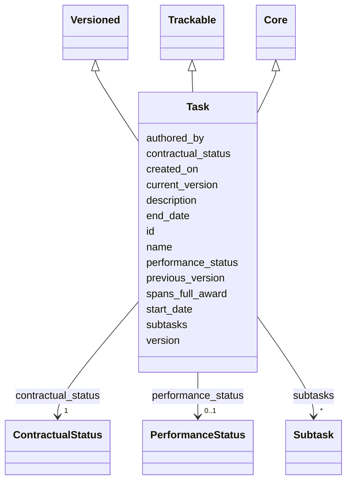

---
search:
  boost: 10.0
---

# Class: Task 


_Thematic bucket of work, possibly spanning the full award._


<div data-search-exclude markdown="1">


URI: [core:Task](https://w3id.org/collabri/core/Task)





## Inheritance
* [Core](Core.md)
    * **Task** [ [Versioned](Versioned.md) [Trackable](Trackable.md)]


## Slots

| Name | Cardinality and Range | Description | Inheritance |
| ---  | --- | --- | --- |
| [spans_full_award](spans_full_award.md) | 0..1 <br/> [Boolean](Boolean.md) | True if the task spans the entire period of performance | direct |
| [start_date](start_date.md) | 0..1 <br/> [Date](Date.md) | Calendar start date of this task (optional; otherwise derived from subtasks) | direct |
| [end_date](end_date.md) | 0..1 <br/> [Date](Date.md) | Calendar end date of this task (optional; otherwise derived from subtasks) | direct |
| [subtasks](subtasks.md) | * <br/> [Subtask](Subtask.md) | Subtasks belonging to this task | direct |
| [version](version.md) | 0..1 <br/> [String](String.md) | Semantic version of this element | [Versioned](Versioned.md) |
| [previous_version](previous_version.md) | 0..1 <br/> [Uriorcurie](Uriorcurie.md) | IRI of the immediately prior version of this element | [Versioned](Versioned.md) |
| [current_version](current_version.md) | 0..1 <br/> [Boolean](Boolean.md) | True iff this is the current accepted version of the element | [Versioned](Versioned.md) |
| [created_on](created_on.md) | 0..1 <br/> [Date](Date.md) | Date this version snapshot was created | [Versioned](Versioned.md) |
| [authored_by](authored_by.md) | * <br/> [Uriorcurie](Uriorcurie.md) | Author(s) of this version snapshot | [Versioned](Versioned.md) |
| [contractual_status](contractual_status.md) | 1 <br/> [ContractualStatus](ContractualStatus.md) | Where this element sits in the contract lifecycle | [Trackable](Trackable.md) |
| [performance_status](performance_status.md) | 0..1 <br/> [PerformanceStatus](PerformanceStatus.md) | Execution state, orthogonal to contractual_status | [Trackable](Trackable.md) |
| [id](id.md) | 1 <br/> [String](String.md) | Stable identifier; together with version forms the element IRI | [Core](Core.md) |
| [name](name.md) | 1 <br/> [String](String.md) | Human-readable name | [Core](Core.md) |
| [description](description.md) | 0..1 <br/> [String](String.md) | Narrative description | [Core](Core.md) |


## Usages

| used by | used in | type | used |
| ---  | --- | --- | --- |
| [TaskTeam](TaskTeam.md) | [tasks](tasks.md) | range | [Task](Task.md) |


## Identifier and Mapping Information


### Schema Source


* from schema: https://w3id.org/collabri/core


## Mappings

| Mapping Type | Mapped Value |
| ---  | ---  |
| self | core:Task |
| native | core:Task |
| close | pplan:Plan, obo:BFO_0000015, frapo:Task |


## LinkML Source

<!-- TODO: investigate https://stackoverflow.com/questions/37606292/how-to-create-tabbed-code-blocks-in-mkdocs-or-sphinx -->

### Direct

<details>
```yaml
name: Task
description: Thematic bucket of work, possibly spanning the full award.
from_schema: https://w3id.org/collabri/core
close_mappings:
- pplan:Plan
- obo:BFO_0000015
- frapo:Task
is_a: Core
mixins:
- Versioned
- Trackable
attributes:
  spans_full_award:
    name: spans_full_award
    description: True if the task spans the entire period of performance.
    in_subset:
    - sow_spec
    - execution_tracking
    from_schema: https://w3id.org/collabri/core
    rank: 1000
    domain_of:
    - Task
    range: boolean
  start_date:
    name: start_date
    description: Calendar start date of this task (optional; otherwise derived from
      subtasks).
    in_subset:
    - sow_spec
    - execution_tracking
    from_schema: https://w3id.org/collabri/core
    rank: 1000
    domain_of:
    - Task
    - Subtask
    range: date
  end_date:
    name: end_date
    description: Calendar end date of this task (optional; otherwise derived from
      subtasks).
    in_subset:
    - sow_spec
    - execution_tracking
    from_schema: https://w3id.org/collabri/core
    rank: 1000
    domain_of:
    - Task
    - Subtask
    range: date
  subtasks:
    name: subtasks
    description: Subtasks belonging to this task.
    in_subset:
    - sow_spec
    - execution_tracking
    from_schema: https://w3id.org/collabri/core
    rank: 1000
    slot_uri: dcterms:hasPart
    domain_of:
    - Task
    - Subtask
    range: Subtask
    multivalued: true
    inlined_as_list: true

```
</details>

### Induced

<details>
```yaml
name: Task
description: Thematic bucket of work, possibly spanning the full award.
from_schema: https://w3id.org/collabri/core
close_mappings:
- pplan:Plan
- obo:BFO_0000015
- frapo:Task
is_a: Core
mixins:
- Versioned
- Trackable
attributes:
  spans_full_award:
    name: spans_full_award
    description: True if the task spans the entire period of performance.
    in_subset:
    - sow_spec
    - execution_tracking
    from_schema: https://w3id.org/collabri/core
    rank: 1000
    owner: Task
    domain_of:
    - Task
    range: boolean
  start_date:
    name: start_date
    description: Calendar start date of this task (optional; otherwise derived from
      subtasks).
    in_subset:
    - sow_spec
    - execution_tracking
    from_schema: https://w3id.org/collabri/core
    rank: 1000
    owner: Task
    domain_of:
    - Task
    - Subtask
    range: date
  end_date:
    name: end_date
    description: Calendar end date of this task (optional; otherwise derived from
      subtasks).
    in_subset:
    - sow_spec
    - execution_tracking
    from_schema: https://w3id.org/collabri/core
    rank: 1000
    owner: Task
    domain_of:
    - Task
    - Subtask
    range: date
  subtasks:
    name: subtasks
    description: Subtasks belonging to this task.
    in_subset:
    - sow_spec
    - execution_tracking
    from_schema: https://w3id.org/collabri/core
    rank: 1000
    slot_uri: dcterms:hasPart
    owner: Task
    domain_of:
    - Task
    - Subtask
    range: Subtask
    multivalued: true
    inlined: true
    inlined_as_list: true
  version:
    name: version
    description: Semantic version of this element.
    in_subset:
    - sow_spec
    - execution_tracking
    from_schema: https://w3id.org/collabri/core
    rank: 1000
    slot_uri: pav:version
    owner: Task
    domain_of:
    - Versioned
    range: string
  previous_version:
    name: previous_version
    description: IRI of the immediately prior version of this element.
    in_subset:
    - execution_tracking
    from_schema: https://w3id.org/collabri/core
    rank: 1000
    slot_uri: pav:previousVersion
    owner: Task
    domain_of:
    - Versioned
    range: uriorcurie
  current_version:
    name: current_version
    description: True iff this is the current accepted version of the element.
    in_subset:
    - execution_tracking
    from_schema: https://w3id.org/collabri/core
    rank: 1000
    slot_uri: pav:hasCurrentVersion
    owner: Task
    domain_of:
    - Versioned
    range: boolean
  created_on:
    name: created_on
    description: Date this version snapshot was created.
    in_subset:
    - sow_spec
    - execution_tracking
    from_schema: https://w3id.org/collabri/core
    rank: 1000
    slot_uri: pav:createdOn
    owner: Task
    domain_of:
    - Versioned
    range: date
  authored_by:
    name: authored_by
    description: Author(s) of this version snapshot.
    in_subset:
    - sow_spec
    - execution_tracking
    from_schema: https://w3id.org/collabri/core
    rank: 1000
    slot_uri: pav:authoredBy
    owner: Task
    domain_of:
    - Versioned
    range: uriorcurie
    multivalued: true
  contractual_status:
    name: contractual_status
    description: Where this element sits in the contract lifecycle.
    in_subset:
    - sow_spec
    - execution_tracking
    from_schema: https://w3id.org/collabri/core
    rank: 1000
    owner: Task
    domain_of:
    - Trackable
    range: ContractualStatus
    required: true
  performance_status:
    name: performance_status
    description: Execution state, orthogonal to contractual_status.
    in_subset:
    - execution_tracking
    from_schema: https://w3id.org/collabri/core
    close_mappings:
    - schema:actionStatus
    rank: 1000
    owner: Task
    domain_of:
    - Trackable
    range: PerformanceStatus
  id:
    name: id
    description: Stable identifier; together with version forms the element IRI.
    in_subset:
    - sow_spec
    - execution_tracking
    from_schema: https://w3id.org/collabri/core
    exact_mappings:
    - schema:identifier
    rank: 1000
    slot_uri: dcterms:identifier
    identifier: true
    owner: Task
    domain_of:
    - Core
    - Change
    - Organization
    - Person
    range: string
    required: true
  name:
    name: name
    description: Human-readable name.
    in_subset:
    - sow_spec
    - execution_tracking
    from_schema: https://w3id.org/collabri/core
    exact_mappings:
    - dcterms:title
    - foaf:name
    rank: 1000
    slot_uri: schema:name
    owner: Task
    domain_of:
    - Core
    - Metric
    - Organization
    - Person
    range: string
    required: true
  description:
    name: description
    description: Narrative description.
    in_subset:
    - sow_spec
    - execution_tracking
    from_schema: https://w3id.org/collabri/core
    exact_mappings:
    - schema:description
    rank: 1000
    slot_uri: dcterms:description
    owner: Task
    domain_of:
    - Core
    range: string

```
</details></div>