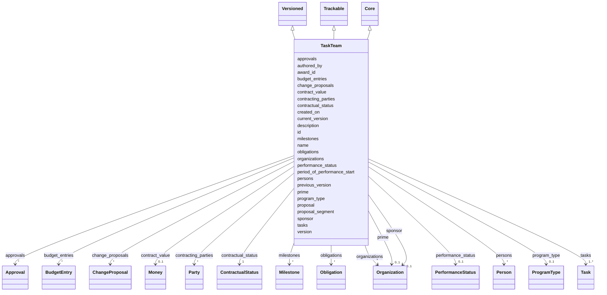

---
search:
  boost: 10.0
---

# Class: TaskTeam 


_Root of a Statement of Work, scoped to a single contract. A TaskTeam owns its tasks (and via them, subtasks), milestones, obligations, and change proposals. "WorkStream" and "task team" are recorded as exact-synonym aliases._

_Lifecycle linkage: a TaskTeam is the post-award realization of an upstream Proposal Intent record (see https://w3id.org/tislab/ proposal-intent/core). The optional `proposal` slot is a uriorcurie foreign key back to pi:Proposal.id, and the optional `proposal_segment` slot labels which slice of that proposal this TaskTeam realizes — because a single Proposal commonly spans multiple task areas, aims, or work packages, each of which becomes its own TaskTeam at award time (Proposal 1 : N TaskTeam). Proposal Intent captures the pre-award shape — sponsor, funding opportunity, deadlines, PI roster, subaward intentions — and Collabri Core picks up at award execution. Loose-coupling by FK keeps the two vocabularies independent: institution-specific extensions of Proposal Intent (UNC, US-federal, etc.) evolve without dragging Collabri Core, and conversely._


<div data-search-exclude markdown="1">


URI: [core:TaskTeam](https://w3id.org/collabri/core/TaskTeam)





## Inheritance
* [Core](Core.md)
    * **TaskTeam** [ [Versioned](Versioned.md) [Trackable](Trackable.md)]


## Class Properties

| Property | Value |
| --- | --- |
| Tree Root | Yes |


## Slots

| Name | Cardinality and Range | Description | Inheritance |
| ---  | --- | --- | --- |
| [award_id](award_id.md) | 0..1 <br/> [String](String.md) | Sponsor award or contract identifier | direct |
| [proposal](proposal.md) | 0..1 <br/> [Uriorcurie](Uriorcurie.md) | Foreign key to the upstream Proposal Intent record this contract derives from... | direct |
| [proposal_segment](proposal_segment.md) | 0..1 <br/> [String](String.md) | Identifier of the slice of the upstream proposal this TaskTeam realizes | direct |
| [contract_value](contract_value.md) | 0..1 <br/> [Money](Money.md) | Headline contract value for convenience | direct |
| [budget_entries](budget_entries.md) | * <br/> [BudgetEntry](BudgetEntry.md) | Contract-level datestamped budget snapshots | direct |
| [program_type](program_type.md) | 0..1 <br/> [ProgramType](ProgramType.md) | Funding mechanism for the contract | direct |
| [period_of_performance_start](period_of_performance_start.md) | 0..1 <br/> [Date](Date.md) | Calendar date on which program month 1 begins | direct |
| [organizations](organizations.md) | * <br/> [Organization](Organization.md) | All organizations participating in the SOW | direct |
| [persons](persons.md) | * <br/> [Person](Person.md) | All people referenced anywhere in the SOW | direct |
| [contracting_parties](contracting_parties.md) | * <br/> [Party](Party.md) | All parties to the contract with their roles | direct |
| [prime](prime.md) | 0..1 <br/> [Organization](Organization.md) | Prime contractor under this contract | direct |
| [sponsor](sponsor.md) | 0..1 <br/> [Organization](Organization.md) | Sponsor under this contract | direct |
| [tasks](tasks.md) | 1..* <br/> [Task](Task.md) | Tasks (thematic buckets) that make up this SOW | direct |
| [milestones](milestones.md) | * <br/> [Milestone](Milestone.md) | Milestones defined at the SOW level (referenced by subtasks) | direct |
| [obligations](obligations.md) | * <br/> [Obligation](Obligation.md) | Non-payment obligations attached at the SOW level (reporting cadence, data-sh... | direct |
| [change_proposals](change_proposals.md) | * <br/> [ChangeProposal](ChangeProposal.md) | Open and historical change proposals against this SOW | direct |
| [approvals](approvals.md) | * <br/> [Approval](Approval.md) | Signoffs against versions of SOW elements | direct |
| [version](version.md) | 0..1 <br/> [String](String.md) | Semantic version of this element | [Versioned](Versioned.md) |
| [previous_version](previous_version.md) | 0..1 <br/> [Uriorcurie](Uriorcurie.md) | IRI of the immediately prior version of this element | [Versioned](Versioned.md) |
| [current_version](current_version.md) | 0..1 <br/> [Boolean](Boolean.md) | True iff this is the current accepted version of the element | [Versioned](Versioned.md) |
| [created_on](created_on.md) | 0..1 <br/> [Date](Date.md) | Date this version snapshot was created | [Versioned](Versioned.md) |
| [authored_by](authored_by.md) | * <br/> [Uriorcurie](Uriorcurie.md) | Author(s) of this version snapshot | [Versioned](Versioned.md) |
| [contractual_status](contractual_status.md) | 1 <br/> [ContractualStatus](ContractualStatus.md) | Where this element sits in the contract lifecycle | [Trackable](Trackable.md) |
| [performance_status](performance_status.md) | 0..1 <br/> [PerformanceStatus](PerformanceStatus.md) | Execution state, orthogonal to contractual_status | [Trackable](Trackable.md) |
| [id](id.md) | 1 <br/> [String](String.md) | Stable identifier; together with version forms the element IRI | [Core](Core.md) |
| [name](name.md) | 1 <br/> [String](String.md) | Human-readable name | [Core](Core.md) |
| [description](description.md) | 0..1 <br/> [String](String.md) | Narrative description | [Core](Core.md) |


## Aliases


* task force


## Identifier and Mapping Information


### Schema Source


* from schema: https://w3id.org/collabri/core


## Mappings

| Mapping Type | Mapped Value |
| ---  | ---  |
| self | core:TaskTeam |
| native | core:TaskTeam |
| close | gist:Agreement, fibo_ctr:Contract, prov:Plan, pplan:Plan |


## LinkML Source

<!-- TODO: investigate https://stackoverflow.com/questions/37606292/how-to-create-tabbed-code-blocks-in-mkdocs-or-sphinx -->

### Direct

<details>
```yaml
name: TaskTeam
description: 'Root of a Statement of Work, scoped to a single contract. A TaskTeam
  owns its tasks (and via them, subtasks), milestones, obligations, and change proposals.
  "WorkStream" and "task team" are recorded as exact-synonym aliases.

  Lifecycle linkage: a TaskTeam is the post-award realization of an upstream Proposal
  Intent record (see https://w3id.org/tislab/ proposal-intent/core). The optional
  `proposal` slot is a uriorcurie foreign key back to pi:Proposal.id, and the optional
  `proposal_segment` slot labels which slice of that proposal this TaskTeam realizes
  — because a single Proposal commonly spans multiple task areas, aims, or work packages,
  each of which becomes its own TaskTeam at award time (Proposal 1 : N TaskTeam).
  Proposal Intent captures the pre-award shape — sponsor, funding opportunity, deadlines,
  PI roster, subaward intentions — and Collabri Core picks up at award execution.
  Loose-coupling by FK keeps the two vocabularies independent: institution-specific
  extensions of Proposal Intent (UNC, US-federal, etc.) evolve without dragging Collabri
  Core, and conversely.'
from_schema: https://w3id.org/collabri/core
aliases:
- task force
structured_aliases:
- literal_form: workstream
  predicate: EXACT_SYNONYM
- literal_form: work stream
  predicate: EXACT_SYNONYM
- literal_form: WorkStream
  predicate: EXACT_SYNONYM
- literal_form: task team
  predicate: EXACT_SYNONYM
close_mappings:
- gist:Agreement
- fibo_ctr:Contract
- prov:Plan
- pplan:Plan
is_a: Core
mixins:
- Versioned
- Trackable
attributes:
  award_id:
    name: award_id
    description: Sponsor award or contract identifier.
    in_subset:
    - sow_spec
    - execution_tracking
    from_schema: https://w3id.org/collabri/core
    rank: 1000
    slot_uri: dcterms:identifier
    domain_of:
    - TaskTeam
  proposal:
    name: proposal
    description: 'Foreign key to the upstream Proposal Intent record this contract
      derives from (pi:Proposal.id in the institution- agnostic Proposal Intent Core
      schema, https://w3id.org/tislab/ proposal-intent/core). Proposal Intent captures
      the pre-award information — sponsor, funding opportunity, PI roster, deadlines,
      subaward intentions — that becomes the working contract scope when awarded.
      Loose coupling by uriorcurie rather than inlining: the proposal and the TaskTeam
      live in different schemas and evolve independently, but link referentially so
      a contract instance can be traced back to its proposal of record.

      Cardinality is Proposal 1 : N TaskTeam. A single proposal commonly spans multiple
      task areas (a DARPA TA1/TA2/TA3 BAA, an NIH multi-aim grant, a multi-PI award
      with separable subscopes) and each awarded slice becomes its own TaskTeam. Use
      proposal_segment to label which slice this TaskTeam realizes.'
    in_subset:
    - sow_spec
    - execution_tracking
    from_schema: https://w3id.org/collabri/core
    close_mappings:
    - dcterms:source
    - prov:wasDerivedFrom
    rank: 1000
    domain_of:
    - TaskTeam
    range: uriorcurie
  proposal_segment:
    name: proposal_segment
    description: 'Identifier of the slice of the upstream proposal this TaskTeam realizes.
      Used when a single Proposal yields multiple TaskTeams (multi-TA BAAs, multi-aim
      grants, multi-PI awards). Free-text by convention — typical values are domain-specific
      strings the proposal itself used: "TA1", "TA2", "Aim 1", "Aim 2", "Work Package
      C", "Subproject A". Becomes a uriorcurie when the upstream Proposal Intent schema
      starts modelling task areas / aims as structured entries; for now it stays a
      string so it can carry whatever the proposal said.'
    in_subset:
    - sow_spec
    - execution_tracking
    from_schema: https://w3id.org/collabri/core
    close_mappings:
    - dcterms:isPartOf
    rank: 1000
    domain_of:
    - TaskTeam
  contract_value:
    name: contract_value
    description: Headline contract value for convenience. The detailed, datestamped
      breakdown lives in budget_entries; contract_value should match the latest working-budget
      entry's headline total.
    in_subset:
    - sow_spec
    - execution_tracking
    from_schema: https://w3id.org/collabri/core
    rank: 1000
    domain_of:
    - TaskTeam
    range: Money
    inlined: true
  budget_entries:
    name: budget_entries
    description: Contract-level datestamped budget snapshots. Captures the proposed
      / awarded / working planning history and the actual / encumbrance execution
      view at the contract total level.
    in_subset:
    - sow_spec
    - execution_tracking
    from_schema: https://w3id.org/collabri/core
    rank: 1000
    domain_of:
    - TaskTeam
    - Subtask
    - Payment
    range: BudgetEntry
    multivalued: true
    inlined_as_list: true
  program_type:
    name: program_type
    description: Funding mechanism for the contract.
    in_subset:
    - sow_spec
    - execution_tracking
    from_schema: https://w3id.org/collabri/core
    rank: 1000
    domain_of:
    - TaskTeam
    range: ProgramType
  period_of_performance_start:
    name: period_of_performance_start
    description: Calendar date on which program month 1 begins. Anchor for converting
      due_month values to absolute calendar dates.
    in_subset:
    - sow_spec
    - execution_tracking
    from_schema: https://w3id.org/collabri/core
    close_mappings:
    - time:hasBeginning
    rank: 1000
    slot_uri: schema:startDate
    domain_of:
    - TaskTeam
    range: date
  organizations:
    name: organizations
    description: All organizations participating in the SOW.
    in_subset:
    - sow_spec
    - execution_tracking
    from_schema: https://w3id.org/collabri/core
    rank: 1000
    domain_of:
    - TaskTeam
    range: Organization
    multivalued: true
    inlined_as_list: true
  persons:
    name: persons
    description: All people referenced anywhere in the SOW.
    in_subset:
    - sow_spec
    - execution_tracking
    from_schema: https://w3id.org/collabri/core
    rank: 1000
    domain_of:
    - TaskTeam
    range: Person
    multivalued: true
    inlined_as_list: true
  contracting_parties:
    name: contracting_parties
    description: All parties to the contract with their roles.
    in_subset:
    - sow_spec
    - execution_tracking
    from_schema: https://w3id.org/collabri/core
    rank: 1000
    domain_of:
    - TaskTeam
    range: Party
    multivalued: true
    inlined_as_list: true
  prime:
    name: prime
    description: Prime contractor under this contract.
    in_subset:
    - sow_spec
    - execution_tracking
    from_schema: https://w3id.org/collabri/core
    rank: 1000
    domain_of:
    - TaskTeam
    range: Organization
  sponsor:
    name: sponsor
    description: Sponsor under this contract.
    in_subset:
    - sow_spec
    - execution_tracking
    from_schema: https://w3id.org/collabri/core
    rank: 1000
    domain_of:
    - TaskTeam
    range: Organization
  tasks:
    name: tasks
    description: Tasks (thematic buckets) that make up this SOW.
    in_subset:
    - sow_spec
    - execution_tracking
    from_schema: https://w3id.org/collabri/core
    rank: 1000
    slot_uri: dcterms:hasPart
    domain_of:
    - TaskTeam
    range: Task
    required: true
    multivalued: true
    inlined_as_list: true
  milestones:
    name: milestones
    description: Milestones defined at the SOW level (referenced by subtasks).
    in_subset:
    - sow_spec
    - execution_tracking
    from_schema: https://w3id.org/collabri/core
    rank: 1000
    domain_of:
    - TaskTeam
    range: Milestone
    multivalued: true
    inlined_as_list: true
  obligations:
    name: obligations
    description: Non-payment obligations attached at the SOW level (reporting cadence,
      data-sharing duties, etc.).
    in_subset:
    - sow_spec
    - execution_tracking
    from_schema: https://w3id.org/collabri/core
    rank: 1000
    domain_of:
    - TaskTeam
    range: Obligation
    multivalued: true
    inlined_as_list: true
  change_proposals:
    name: change_proposals
    description: Open and historical change proposals against this SOW.
    in_subset:
    - execution_tracking
    from_schema: https://w3id.org/collabri/core
    rank: 1000
    domain_of:
    - TaskTeam
    range: ChangeProposal
    multivalued: true
    inlined_as_list: true
  approvals:
    name: approvals
    description: Signoffs against versions of SOW elements.
    in_subset:
    - execution_tracking
    from_schema: https://w3id.org/collabri/core
    rank: 1000
    domain_of:
    - TaskTeam
    range: Approval
    multivalued: true
    inlined_as_list: true
tree_root: true

```
</details>

### Induced

<details>
```yaml
name: TaskTeam
description: 'Root of a Statement of Work, scoped to a single contract. A TaskTeam
  owns its tasks (and via them, subtasks), milestones, obligations, and change proposals.
  "WorkStream" and "task team" are recorded as exact-synonym aliases.

  Lifecycle linkage: a TaskTeam is the post-award realization of an upstream Proposal
  Intent record (see https://w3id.org/tislab/ proposal-intent/core). The optional
  `proposal` slot is a uriorcurie foreign key back to pi:Proposal.id, and the optional
  `proposal_segment` slot labels which slice of that proposal this TaskTeam realizes
  — because a single Proposal commonly spans multiple task areas, aims, or work packages,
  each of which becomes its own TaskTeam at award time (Proposal 1 : N TaskTeam).
  Proposal Intent captures the pre-award shape — sponsor, funding opportunity, deadlines,
  PI roster, subaward intentions — and Collabri Core picks up at award execution.
  Loose-coupling by FK keeps the two vocabularies independent: institution-specific
  extensions of Proposal Intent (UNC, US-federal, etc.) evolve without dragging Collabri
  Core, and conversely.'
from_schema: https://w3id.org/collabri/core
aliases:
- task force
structured_aliases:
- literal_form: workstream
  predicate: EXACT_SYNONYM
- literal_form: work stream
  predicate: EXACT_SYNONYM
- literal_form: WorkStream
  predicate: EXACT_SYNONYM
- literal_form: task team
  predicate: EXACT_SYNONYM
close_mappings:
- gist:Agreement
- fibo_ctr:Contract
- prov:Plan
- pplan:Plan
is_a: Core
mixins:
- Versioned
- Trackable
attributes:
  award_id:
    name: award_id
    description: Sponsor award or contract identifier.
    in_subset:
    - sow_spec
    - execution_tracking
    from_schema: https://w3id.org/collabri/core
    rank: 1000
    slot_uri: dcterms:identifier
    owner: TaskTeam
    domain_of:
    - TaskTeam
    range: string
  proposal:
    name: proposal
    description: 'Foreign key to the upstream Proposal Intent record this contract
      derives from (pi:Proposal.id in the institution- agnostic Proposal Intent Core
      schema, https://w3id.org/tislab/ proposal-intent/core). Proposal Intent captures
      the pre-award information — sponsor, funding opportunity, PI roster, deadlines,
      subaward intentions — that becomes the working contract scope when awarded.
      Loose coupling by uriorcurie rather than inlining: the proposal and the TaskTeam
      live in different schemas and evolve independently, but link referentially so
      a contract instance can be traced back to its proposal of record.

      Cardinality is Proposal 1 : N TaskTeam. A single proposal commonly spans multiple
      task areas (a DARPA TA1/TA2/TA3 BAA, an NIH multi-aim grant, a multi-PI award
      with separable subscopes) and each awarded slice becomes its own TaskTeam. Use
      proposal_segment to label which slice this TaskTeam realizes.'
    in_subset:
    - sow_spec
    - execution_tracking
    from_schema: https://w3id.org/collabri/core
    close_mappings:
    - dcterms:source
    - prov:wasDerivedFrom
    rank: 1000
    owner: TaskTeam
    domain_of:
    - TaskTeam
    range: uriorcurie
  proposal_segment:
    name: proposal_segment
    description: 'Identifier of the slice of the upstream proposal this TaskTeam realizes.
      Used when a single Proposal yields multiple TaskTeams (multi-TA BAAs, multi-aim
      grants, multi-PI awards). Free-text by convention — typical values are domain-specific
      strings the proposal itself used: "TA1", "TA2", "Aim 1", "Aim 2", "Work Package
      C", "Subproject A". Becomes a uriorcurie when the upstream Proposal Intent schema
      starts modelling task areas / aims as structured entries; for now it stays a
      string so it can carry whatever the proposal said.'
    in_subset:
    - sow_spec
    - execution_tracking
    from_schema: https://w3id.org/collabri/core
    close_mappings:
    - dcterms:isPartOf
    rank: 1000
    owner: TaskTeam
    domain_of:
    - TaskTeam
    range: string
  contract_value:
    name: contract_value
    description: Headline contract value for convenience. The detailed, datestamped
      breakdown lives in budget_entries; contract_value should match the latest working-budget
      entry's headline total.
    in_subset:
    - sow_spec
    - execution_tracking
    from_schema: https://w3id.org/collabri/core
    rank: 1000
    owner: TaskTeam
    domain_of:
    - TaskTeam
    range: Money
    inlined: true
  budget_entries:
    name: budget_entries
    description: Contract-level datestamped budget snapshots. Captures the proposed
      / awarded / working planning history and the actual / encumbrance execution
      view at the contract total level.
    in_subset:
    - sow_spec
    - execution_tracking
    from_schema: https://w3id.org/collabri/core
    rank: 1000
    owner: TaskTeam
    domain_of:
    - TaskTeam
    - Subtask
    - Payment
    range: BudgetEntry
    multivalued: true
    inlined: true
    inlined_as_list: true
  program_type:
    name: program_type
    description: Funding mechanism for the contract.
    in_subset:
    - sow_spec
    - execution_tracking
    from_schema: https://w3id.org/collabri/core
    rank: 1000
    owner: TaskTeam
    domain_of:
    - TaskTeam
    range: ProgramType
  period_of_performance_start:
    name: period_of_performance_start
    description: Calendar date on which program month 1 begins. Anchor for converting
      due_month values to absolute calendar dates.
    in_subset:
    - sow_spec
    - execution_tracking
    from_schema: https://w3id.org/collabri/core
    close_mappings:
    - time:hasBeginning
    rank: 1000
    slot_uri: schema:startDate
    owner: TaskTeam
    domain_of:
    - TaskTeam
    range: date
  organizations:
    name: organizations
    description: All organizations participating in the SOW.
    in_subset:
    - sow_spec
    - execution_tracking
    from_schema: https://w3id.org/collabri/core
    rank: 1000
    owner: TaskTeam
    domain_of:
    - TaskTeam
    range: Organization
    multivalued: true
    inlined: true
    inlined_as_list: true
  persons:
    name: persons
    description: All people referenced anywhere in the SOW.
    in_subset:
    - sow_spec
    - execution_tracking
    from_schema: https://w3id.org/collabri/core
    rank: 1000
    owner: TaskTeam
    domain_of:
    - TaskTeam
    range: Person
    multivalued: true
    inlined: true
    inlined_as_list: true
  contracting_parties:
    name: contracting_parties
    description: All parties to the contract with their roles.
    in_subset:
    - sow_spec
    - execution_tracking
    from_schema: https://w3id.org/collabri/core
    rank: 1000
    owner: TaskTeam
    domain_of:
    - TaskTeam
    range: Party
    multivalued: true
    inlined: true
    inlined_as_list: true
  prime:
    name: prime
    description: Prime contractor under this contract.
    in_subset:
    - sow_spec
    - execution_tracking
    from_schema: https://w3id.org/collabri/core
    rank: 1000
    owner: TaskTeam
    domain_of:
    - TaskTeam
    range: Organization
  sponsor:
    name: sponsor
    description: Sponsor under this contract.
    in_subset:
    - sow_spec
    - execution_tracking
    from_schema: https://w3id.org/collabri/core
    rank: 1000
    owner: TaskTeam
    domain_of:
    - TaskTeam
    range: Organization
  tasks:
    name: tasks
    description: Tasks (thematic buckets) that make up this SOW.
    in_subset:
    - sow_spec
    - execution_tracking
    from_schema: https://w3id.org/collabri/core
    rank: 1000
    slot_uri: dcterms:hasPart
    owner: TaskTeam
    domain_of:
    - TaskTeam
    range: Task
    required: true
    multivalued: true
    inlined: true
    inlined_as_list: true
  milestones:
    name: milestones
    description: Milestones defined at the SOW level (referenced by subtasks).
    in_subset:
    - sow_spec
    - execution_tracking
    from_schema: https://w3id.org/collabri/core
    rank: 1000
    owner: TaskTeam
    domain_of:
    - TaskTeam
    range: Milestone
    multivalued: true
    inlined: true
    inlined_as_list: true
  obligations:
    name: obligations
    description: Non-payment obligations attached at the SOW level (reporting cadence,
      data-sharing duties, etc.).
    in_subset:
    - sow_spec
    - execution_tracking
    from_schema: https://w3id.org/collabri/core
    rank: 1000
    owner: TaskTeam
    domain_of:
    - TaskTeam
    range: Obligation
    multivalued: true
    inlined: true
    inlined_as_list: true
  change_proposals:
    name: change_proposals
    description: Open and historical change proposals against this SOW.
    in_subset:
    - execution_tracking
    from_schema: https://w3id.org/collabri/core
    rank: 1000
    owner: TaskTeam
    domain_of:
    - TaskTeam
    range: ChangeProposal
    multivalued: true
    inlined: true
    inlined_as_list: true
  approvals:
    name: approvals
    description: Signoffs against versions of SOW elements.
    in_subset:
    - execution_tracking
    from_schema: https://w3id.org/collabri/core
    rank: 1000
    owner: TaskTeam
    domain_of:
    - TaskTeam
    range: Approval
    multivalued: true
    inlined: true
    inlined_as_list: true
  version:
    name: version
    description: Semantic version of this element.
    in_subset:
    - sow_spec
    - execution_tracking
    from_schema: https://w3id.org/collabri/core
    rank: 1000
    slot_uri: pav:version
    owner: TaskTeam
    domain_of:
    - Versioned
    range: string
  previous_version:
    name: previous_version
    description: IRI of the immediately prior version of this element.
    in_subset:
    - execution_tracking
    from_schema: https://w3id.org/collabri/core
    rank: 1000
    slot_uri: pav:previousVersion
    owner: TaskTeam
    domain_of:
    - Versioned
    range: uriorcurie
  current_version:
    name: current_version
    description: True iff this is the current accepted version of the element.
    in_subset:
    - execution_tracking
    from_schema: https://w3id.org/collabri/core
    rank: 1000
    slot_uri: pav:hasCurrentVersion
    owner: TaskTeam
    domain_of:
    - Versioned
    range: boolean
  created_on:
    name: created_on
    description: Date this version snapshot was created.
    in_subset:
    - sow_spec
    - execution_tracking
    from_schema: https://w3id.org/collabri/core
    rank: 1000
    slot_uri: pav:createdOn
    owner: TaskTeam
    domain_of:
    - Versioned
    range: date
  authored_by:
    name: authored_by
    description: Author(s) of this version snapshot.
    in_subset:
    - sow_spec
    - execution_tracking
    from_schema: https://w3id.org/collabri/core
    rank: 1000
    slot_uri: pav:authoredBy
    owner: TaskTeam
    domain_of:
    - Versioned
    range: uriorcurie
    multivalued: true
  contractual_status:
    name: contractual_status
    description: Where this element sits in the contract lifecycle.
    in_subset:
    - sow_spec
    - execution_tracking
    from_schema: https://w3id.org/collabri/core
    rank: 1000
    owner: TaskTeam
    domain_of:
    - Trackable
    range: ContractualStatus
    required: true
  performance_status:
    name: performance_status
    description: Execution state, orthogonal to contractual_status.
    in_subset:
    - execution_tracking
    from_schema: https://w3id.org/collabri/core
    close_mappings:
    - schema:actionStatus
    rank: 1000
    owner: TaskTeam
    domain_of:
    - Trackable
    range: PerformanceStatus
  id:
    name: id
    description: Stable identifier; together with version forms the element IRI.
    in_subset:
    - sow_spec
    - execution_tracking
    from_schema: https://w3id.org/collabri/core
    exact_mappings:
    - schema:identifier
    rank: 1000
    slot_uri: dcterms:identifier
    identifier: true
    owner: TaskTeam
    domain_of:
    - Core
    - Change
    - Organization
    - Person
    range: string
    required: true
  name:
    name: name
    description: Human-readable name.
    in_subset:
    - sow_spec
    - execution_tracking
    from_schema: https://w3id.org/collabri/core
    exact_mappings:
    - dcterms:title
    - foaf:name
    rank: 1000
    slot_uri: schema:name
    owner: TaskTeam
    domain_of:
    - Core
    - Metric
    - Organization
    - Person
    range: string
    required: true
  description:
    name: description
    description: Narrative description.
    in_subset:
    - sow_spec
    - execution_tracking
    from_schema: https://w3id.org/collabri/core
    exact_mappings:
    - schema:description
    rank: 1000
    slot_uri: dcterms:description
    owner: TaskTeam
    domain_of:
    - Core
    range: string
tree_root: true

```
</details></div>