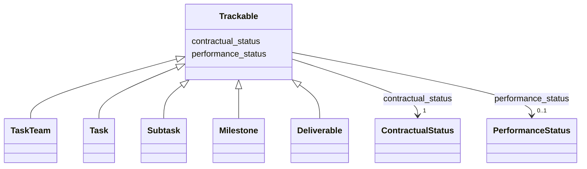

---
search:
  boost: 10.0
---

# Class: Trackable 


_Mixin: dual-axis status. ContractualStatus tracks where the element sits in the contract lifecycle (draft, approved, executed, etc.); PerformanceStatus tracks the orthogonal execution state (in progress, blocked, at risk, completed). The two axes never collapse._


<div data-search-exclude markdown="1">


URI: [core:Trackable](https://w3id.org/collabri/core/Trackable)





<!-- no inheritance hierarchy -->

## Class Properties

| Property | Value |
| --- | --- |
| Mixin | Yes |


## Slots

| Name | Cardinality and Range | Description | Inheritance |
| ---  | --- | --- | --- |
| [contractual_status](contractual_status.md) | 1 <br/> [ContractualStatus](ContractualStatus.md) | Where this element sits in the contract lifecycle | direct |
| [performance_status](performance_status.md) | 0..1 <br/> [PerformanceStatus](PerformanceStatus.md) | Execution state, orthogonal to contractual_status | direct |


## Mixin Usage

| mixed into | description |
| --- | --- |
| [TaskTeam](TaskTeam.md) | Root of a Statement of Work, scoped to a single contract |
| [Task](Task.md) | Thematic bucket of work, possibly spanning the full award |
| [Subtask](Subtask.md) | A step toward completion of a Task |
| [Milestone](Milestone.md) | A milestone groups subtasks (linked via Subtask |
| [Deliverable](Deliverable.md) | A concrete, acceptance-bearing output owed for a payable subtask |


## Identifier and Mapping Information


### Schema Source


* from schema: https://w3id.org/collabri/core


## Mappings

| Mapping Type | Mapped Value |
| ---  | ---  |
| self | core:Trackable |
| native | core:Trackable |


## LinkML Source

<!-- TODO: investigate https://stackoverflow.com/questions/37606292/how-to-create-tabbed-code-blocks-in-mkdocs-or-sphinx -->

### Direct

<details>
```yaml
name: Trackable
description: 'Mixin: dual-axis status. ContractualStatus tracks where the element
  sits in the contract lifecycle (draft, approved, executed, etc.); PerformanceStatus
  tracks the orthogonal execution state (in progress, blocked, at risk, completed).
  The two axes never collapse.'
from_schema: https://w3id.org/collabri/core
mixin: true
attributes:
  contractual_status:
    name: contractual_status
    description: Where this element sits in the contract lifecycle.
    in_subset:
    - sow_spec
    - execution_tracking
    from_schema: https://w3id.org/collabri/core
    rank: 1000
    domain_of:
    - Trackable
    range: ContractualStatus
    required: true
  performance_status:
    name: performance_status
    description: Execution state, orthogonal to contractual_status.
    in_subset:
    - execution_tracking
    from_schema: https://w3id.org/collabri/core
    close_mappings:
    - schema:actionStatus
    rank: 1000
    domain_of:
    - Trackable
    range: PerformanceStatus

```
</details>

### Induced

<details>
```yaml
name: Trackable
description: 'Mixin: dual-axis status. ContractualStatus tracks where the element
  sits in the contract lifecycle (draft, approved, executed, etc.); PerformanceStatus
  tracks the orthogonal execution state (in progress, blocked, at risk, completed).
  The two axes never collapse.'
from_schema: https://w3id.org/collabri/core
mixin: true
attributes:
  contractual_status:
    name: contractual_status
    description: Where this element sits in the contract lifecycle.
    in_subset:
    - sow_spec
    - execution_tracking
    from_schema: https://w3id.org/collabri/core
    rank: 1000
    owner: Trackable
    domain_of:
    - Trackable
    range: ContractualStatus
    required: true
  performance_status:
    name: performance_status
    description: Execution state, orthogonal to contractual_status.
    in_subset:
    - execution_tracking
    from_schema: https://w3id.org/collabri/core
    close_mappings:
    - schema:actionStatus
    rank: 1000
    owner: Trackable
    domain_of:
    - Trackable
    range: PerformanceStatus

```
</details></div>